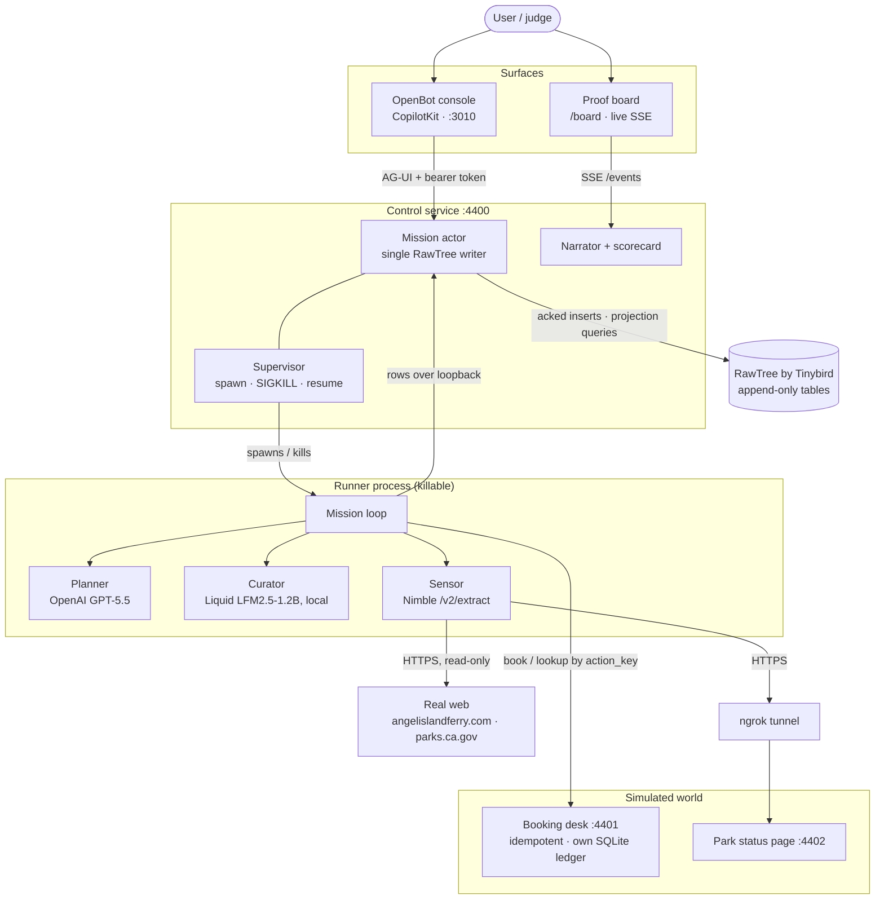
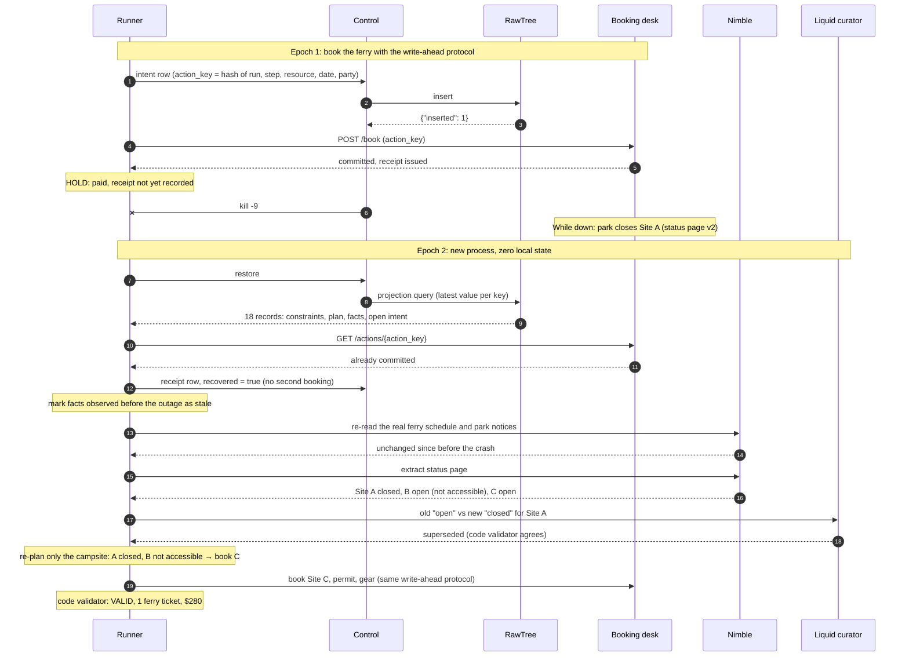
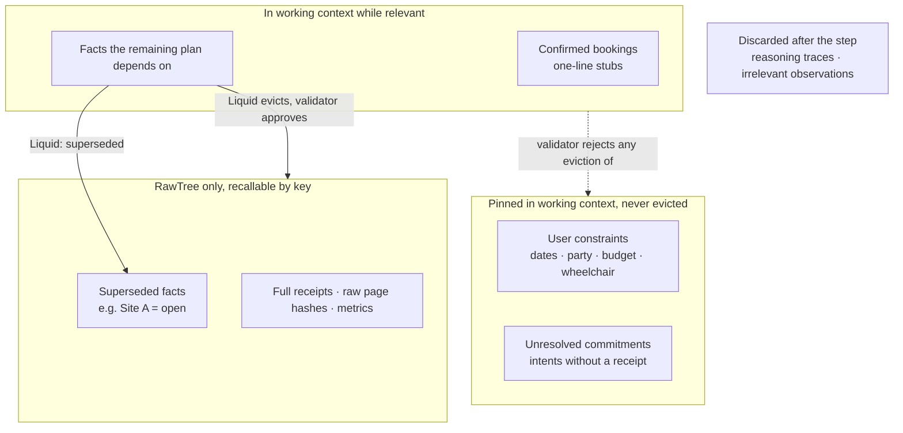

# Dead Reckoning

> **Kill a long-running agent mid-booking, change the world while it's down, and watch it come back with no memory, pay nothing twice, notice what changed, and still honor every constraint.**
>
> *Receipts before plans. Revalidation before action. A working memory the size of the job, not the size of its history.*

Built at the **Long Horizon Agents Hack** (tokens&, AWS Builder Loft, San Francisco, Sep 25 2026) with **RawTree by Tinybird**, **Nimble**, **Liquid AI**, **OpenAI** and **CopilotKit OpenBot**.

---

## Contents

- [The problem](#the-problem)
- [The demo in one minute](#the-demo-in-one-minute)
- [Architecture](#architecture)
- [How crash recovery works](#how-crash-recovery-works)
- [What persists, what gets discarded](#what-persists-what-gets-discarded)
- [Sponsor technology](#sponsor-technology)
- [Quick start](#quick-start)
- [Tests and scripts](#tests-and-scripts)
- [What is real, what is simulated](#what-is-real-what-is-simulated)
- [Repository layout](#repository-layout)

---

## The problem

Long-running agents keep their memory in a growing transcript. When the process dies (a deploy, a rate limit, a closed laptop), that transcript can't answer the two questions that matter:

1. **What did I actually do?** If the agent paid for something and died before writing the receipt down, a transcript-resume agent pays again.
2. **What is still true?** Facts observed hours ago are treated as current, and compaction quietly drops the constraints that mattered.

Dead Reckoning replaces the transcript with **explicit, typed state in an append-only log**, a **write-ahead protocol** for every real-world action, and **revalidation of stale facts** before they are used.

## The demo in one minute

A user asks for a 3-day Angel Island trip: Oct 9–11, 2 people, $400 budget, and **one traveler uses a wheelchair**. The plan has four steps: ferry → campsite → permit → gear.

Two agents run the same mission side by side, with the same planner model, booking desk and crash point:

| | 🔵 **Dead Reckoning** | 🟠 **Ordinary agent** (baseline) |
|---|---|---|
| Memory after a crash | Rebuilt from the RawTree log | Reloads its own chat transcript |
| Asks the desk "did I already pay?" | Yes, by idempotency key | No |
| Re-checks stale facts | Yes, via Nimble + local Liquid curator | No |
| Working context | Re-rendered from state each step | Grows with every step |

**The run:**

1. Both agents pay for the ferry and pause **right after the desk commits, before the receipt is recorded**: the worst moment to crash.
2. Both are killed with a real `kill -9`.
3. While they're down, the park closes **Site A**, the wheelchair-accessible campsite they both chose.
4. Both restart.

**Result from a live run** (counts come from the booking desk's own ledger, not from the agents):

| | 🔵 Dead Reckoning | 🟠 Ordinary agent |
|---|---|---|
| Verdict | ✅ VALID | ❌ INVALID |
| Ferry tickets paid | 1 (receipt recovered from the desk) | **2** (charged twice) |
| Campsite | Site C (accessible) | Tried Site A, rejected: closed |
| Bookings made on stale info | 0 | 1 |
| Total charged | $280 | $310 |
| Planner context per step (tokens) | 528 → 621 → 444 → 460 | 485 → 555 → 684 → 740 → 835 |

**Real web, alongside the simulation.** Dead Reckoning also reads two real pages through Nimble: the operator's [Angel Island–Tiburon ferry schedule](https://angelislandferry.com/schedule) and the [Angel Island State Park](https://www.parks.ca.gov/?page_id=468) notices. Before booking the ferry it checks, in code, that the real schedule runs a ferry on the trip date (Friday Oct 9: departures 10 am, 11 am, 1 pm, 3 pm campers only), and blocks if it doesn't. After the crash it re-reads both pages and reports what changed while it was down, usually nothing, which is the honest answer. The campsite closure stays simulated so the dramatic moment happens on cue.

The campsites: **Site A** is accessible but closes during the outage; **Site B** is open but *not* accessible (the trap for an agent that forgot the wheelchair); **Site C** is open and accessible (the correct repair).

A second fixture, **F3b**, closes Site C as well. Dead Reckoning then ends **BLOCKED** with a precise reason (no open, accessible campsite left) instead of inventing a success, still with exactly one ferry ticket.

## Architecture



Design choices that matter:

- **The runner never holds the RawTree key.** It sends every row to the control service, which writes it and waits for RawTree's `{"inserted": N}` acknowledgement. Killing the runner can't lose an acknowledged row.
- **The desk is the authority on effects.** RawTree records what the agent *intended* and *observed*; the desk's own ledger decides whether a booking happened.
- **Everything listens on 127.0.0.1.** Only the read-only status page is exposed, through ngrok, so Nimble can fetch it.

## How crash recovery works



Six invariants are checked **in code**, not by a model:

1. No desk call without an acknowledged intent row.
2. No re-execution of an `action_key` that already has a success receipt.
3. No step runs while it depends on a stale, unrevalidated fact.
4. At most one committed booking per slot.
5. A confirmed booking is only replaced by an explicit compensating action or a block.
6. The run ends **VALID** or **BLOCKED with a reason**, never a silent success. An unreachable desk means BLOCKED, not "probably fine".

## What persists, what gets discarded

The planner's prompt is **re-rendered from state on every step**, never appended to. It stays under a 6,000-token budget no matter how long the run.



The Liquid curator proposes which items leave working memory; a code validator refuses any eviction of a constraint or an unresolved commitment. In the live run, it dropped the pre-outage Site A note: 10 → 9 items, 461 → 377 tokens.

## Sponsor technology

| Sponsor | Role in Dead Reckoning | What to look for |
|---|---|---|
| **RawTree by Tinybird** | The agent's only durable memory. Eight append-only tables: `epochs`, `constraints`, `facts`, `commitments`, `receipts`, `plan_steps`, `context_ops`, `metrics`. Restore is a projection query; the closing numbers are live SQL. | "RESTORING FROM RAWTREE… 18 records" after the kill; `npm run demo:numbers` |
| **Nimble** | The agent's eyes on the web. `POST /v2/extract` reads the simulated park status page through the tunnel (14 fields parsed **server-side** with a schema parser), and the **real** ferry schedule and park notices pages, re-checked after every restart. | "Real web via Nimble: angelislandferry.com…", "Re-checked the real parks.ca.gov page after the outage" |
| **Liquid AI** | `LFM2.5-1.2B-Instruct` on llama.cpp, **on the laptop**, with JSON-schema constrained output. Two narrow jobs every step: compare an old fact with a new observation, and choose what to evict from working memory. | "Liquid curator: Site A open → closed", "Liquid trimmed working memory" |
| **OpenAI** | GPT-5.5 via the Responses API with strict JSON schema, choosing among a bounded action set (`book`, `cancel`, `keep`, `block`) over candidates that code has already filtered. | "Planner chose Site C. Ruled out in code: Site A (closed), Site B (not wheelchair accessible)" |
| **CopilotKit OpenBot** | The chat console. Dead Reckoning is registered as a remote AG-UI agent; OpenBot authenticates with a shared bearer token. CopilotKit Intelligence stores the threads. | Chat with the Dead Reckoning agent at `http://127.0.0.1:3010` |

## Quick start

### Prerequisites

- Node 20+, npm, [Bun](https://bun.sh) 1.3.14, Docker (Colima works), `llama.cpp` (`brew install llama.cpp`), `ngrok`
- A root `.env` copied from [`.env.example`](.env.example) with keys for RawTree, Nimble, OpenAI and CopilotKit Intelligence
- Postgres for OpenBot, e.g. `docker run -d --name dr-postgres -e POSTGRES_PASSWORD=… -p 127.0.0.1:5433:5432 pgvector/pgvector:pg17`

### Run everything

```sh
npm install
scripts/dev.sh up        # starts Liquid, desk, control, ngrok and OpenBot; skips anything already running
scripts/dev.sh status    # what's up, plus the tunnel and UI links
```

`npm run dev:desk` or `npm run dev:control` failing with "address already in use" means that service is already running. Use `scripts/dev.sh status` instead.

| Command | Does |
|---|---|
| `scripts/dev.sh up` | Start anything that isn't running |
| `scripts/dev.sh up public` | Also start a public link to OpenBot (Cloudflare quick tunnel; anyone with the link is an admin) |
| `scripts/dev.sh restart control` | Restart one service: `liquid`, `desk`, `control`, `ngrok`, `openbot` or `public` |
| `scripts/dev.sh down` | Stop everything the script manages |

### Drive the demo from the chat

Open **http://127.0.0.1:3010** and message the **Dead Reckoning** agent:

| Say | What happens |
|---|---|
| `plan my Angel Island trip` | Resets the world and starts both agents; streams until both pause after paying for the ferry |
| `kill` (or `crash`) | `kill -9` on both paused agents |
| `close site A` | The park closes Site A while they're down |
| `resume` | Restarts both; streams the recovery and ends with the scorecard |
| `details` | The full technical log for the latest runs |
| `status` / `scorecard` | Receipts per agent, or the scorecard again |

### Or from the proof board

Open **http://127.0.0.1:4400/board**, paste `DR_OPERATOR_TOKEN` into the token field once, then press **1 Start both → 2 Crash → 3 Close Site A → 4 Bring back**. The two agents are color-coded (🔵 blue, 🟠 orange), each with its narrated story, receipts and token bars, and the scorecard appears when both finish.

## Tests and scripts

```sh
npm run check:types      # type-check every package
npm run test:unit        # 97 unit tests
npm run test:recovery    # real-SIGKILL recovery tests (R02)
./scripts/demo-f3.sh     # full F3 run end to end against live services: 11/11 checks
npm run demo:f3b         # F3b: Site A and Site C closed → Dead Reckoning BLOCKED: 13/13 checks
npm run demo:numbers     # closing numbers queried live from RawTree
npm run smoke:rawtree    # also smoke:nimble, smoke:liquid, smoke:planner
```

## What is real, what is simulated

| Real | Simulated |
|---|---|
| The crash: a real `kill -9` of a real process, restarted with a new pid | The booking desk: a local service with its own SQLite ledger; no real money |
| RawTree as the only durable state; every row acknowledged before it counts | The park status page: a local page edited on cue to close Site A |
| Nimble fetching and parsing that page over the internet | The "+48 h" clock jump (labeled `SIMULATED`) |
| The real ferry schedule and park notices, read at start and re-checked after the crash; the ferry gate uses the real schedule | |
| The Liquid model running locally, and GPT-5.5 choosing each booking | |
| Token counts measured on the exact planner input | |

**About the baseline.** The ordinary agent is a *transcript-resume baseline*, not a competitor tuned to win. It uses the same planner, desk and fixture, but reloads a local transcript and skips reconciliation and revalidation. It shows what goes wrong without recovery; it does not prove Dead Reckoning beats a well-engineered alternative. Both are judged by the same code validator.

**Known limits.** Nimble's documented domain-health endpoint returns 404 for our account, so it is not used. Control-process loss (as opposed to runner loss) is out of scope. With four planner calls the context doesn't come under pressure; the claim is "bounded and doesn't grow with history", not a benchmark.

## Repository layout

```text
packages/
  shared/      types, table names, action keys, config loader, fixture F3
  storage/     RawTree client, acknowledged sink, projection loader
  kernel/      write-ahead protocol, recovery, ordinary-agent transcript
  desk/        simulated booking desk (:4401) and park status page (:4402)
  providers/   Nimble sensor, Liquid curator, OpenAI planner, context composer
  runner/      the mission loop and the terminal validator
  control/     mission actor, supervisor, narrator, AG-UI endpoint, /board (:4400)
apps/console/  OpenBot export (CopilotKit) with the dead-reckoning tenant
scripts/       dev.sh, demo-f3, demo-numbers, public proxy
docs/          research, sponsor briefs, design specs, implementation worklog
```

Design and history: [docs/FINAL_PROJECT.md](docs/FINAL_PROJECT.md) (the original spec), [docs/implementation/](docs/implementation/) (contracts, validation plan, and a worklog of everything built and measured today), [AGENTS.md](AGENTS.md) (instructions for coding agents).
