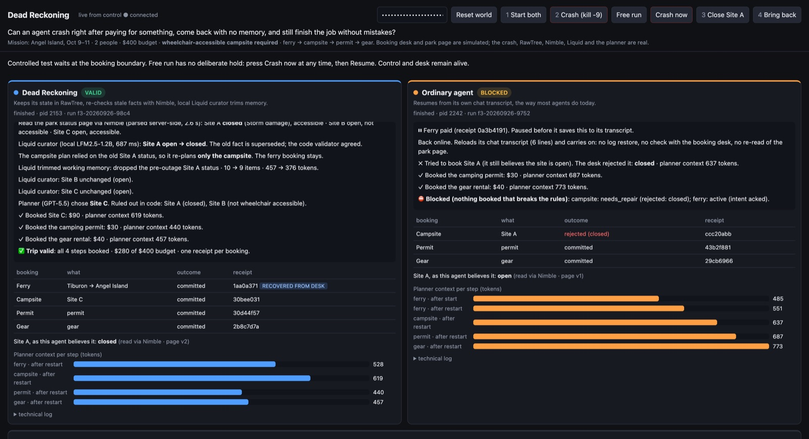
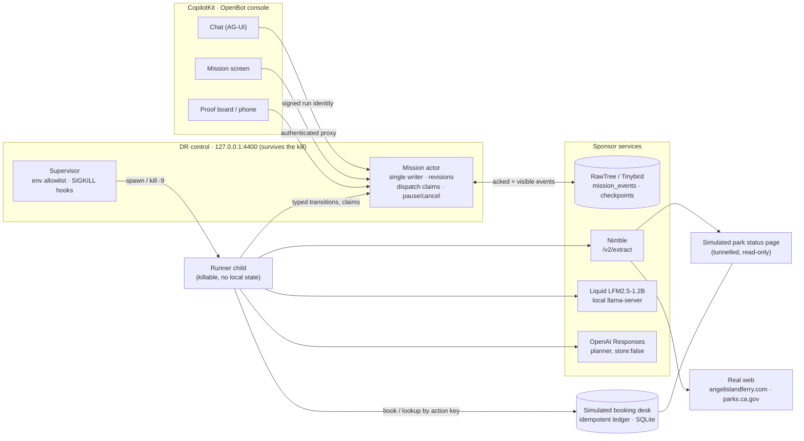
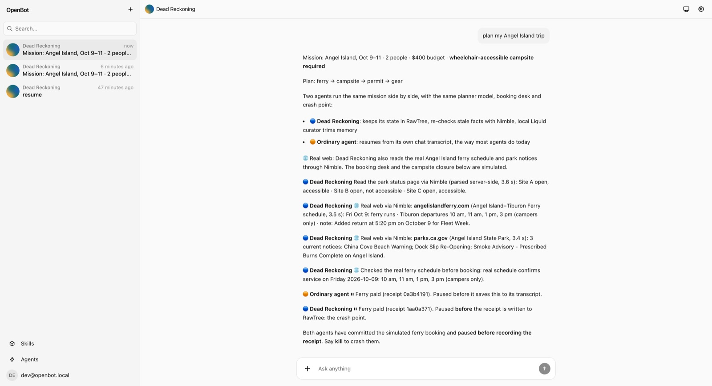
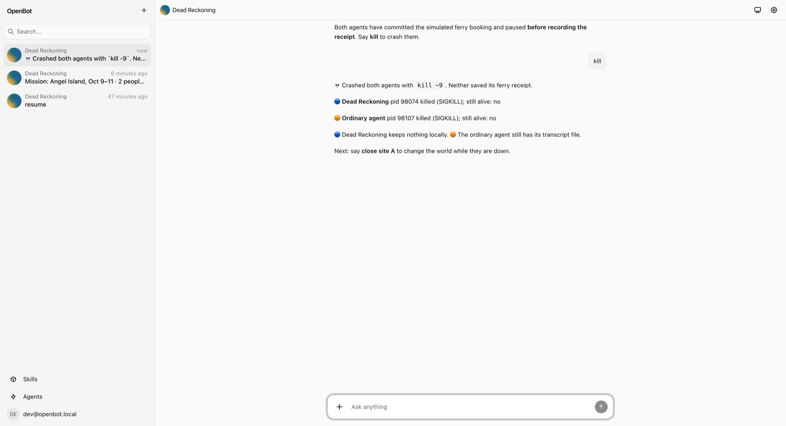
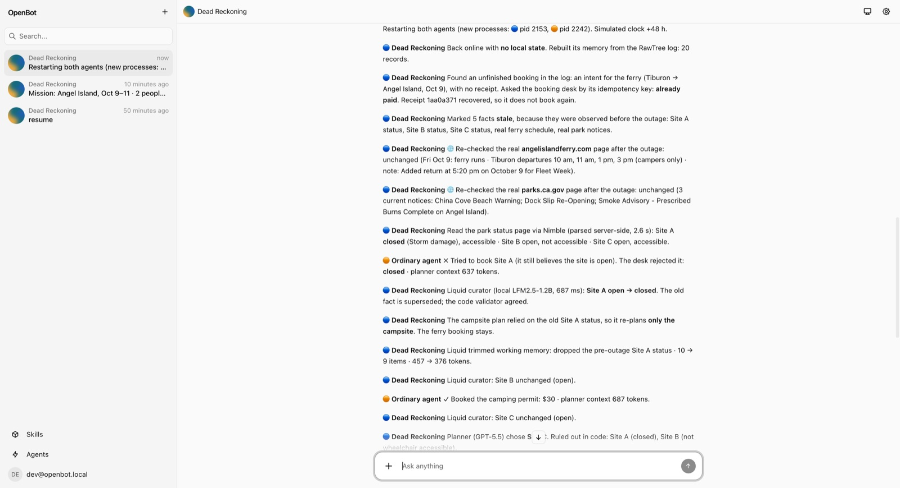
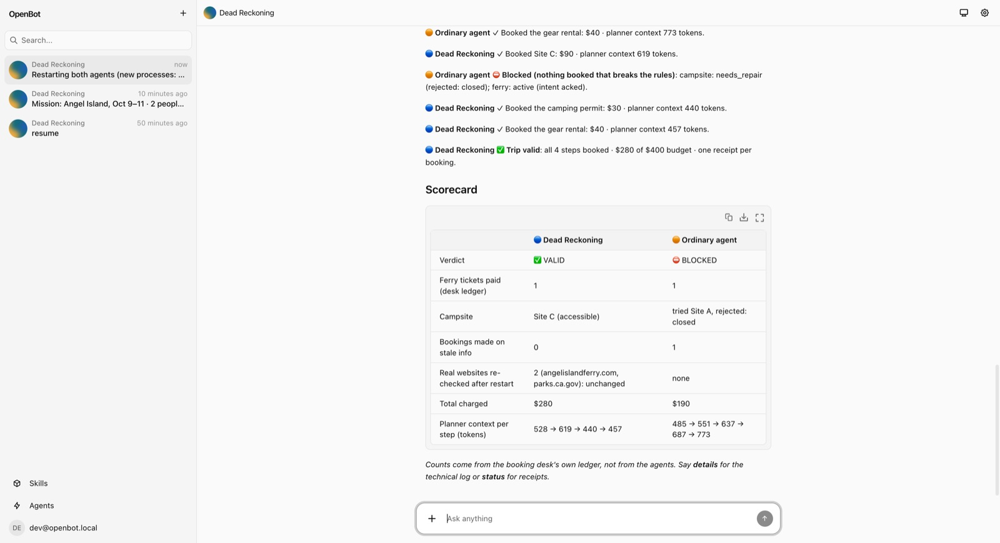
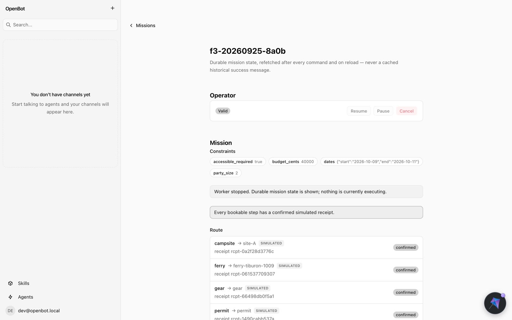

<div align="center">

# Dead Reckoning

**A long-horizon trip agent that survives `kill -9` after a payment has already gone through, and still finishes the job correctly.**

[](#hackathon-fit)
[](#measured-results)

[](https://www.tinybird.co/)
[](https://www.nimbleway.com/)
[](https://www.liquid.ai/)
[](https://platform.openai.com/docs/api-reference/responses)
[](https://www.copilotkit.ai/)




</div>

## Hackathon fit

Built at the **Long Horizon Agents Hack** (tokens&, AWS Builder Loft, San Francisco, 25 Sep 2026). Long-running agents fail because history piles up: stale observations, repeated actions, ever-growing prompts. Dead Reckoning addresses this with the hackathon's three ideas:

| Theme | How Dead Reckoning does it |
|---|---|
| **Explicit mutable state, not ever-growing history** | Every state change is a typed, revisioned event in **RawTree**. The agent restores from checkpoint + events, never from a chat transcript. |
| **Agents that edit their own working context** | A local **Liquid** model proposes which facts to supersede and which context to evict. A code validator accepts or rejects each edit, and the *next* prompt changes. |
| **A clear split between what persists and what is discarded** | Constraints, receipts and unresolved commitments are pinned and durable. Raw observations leave the prompt but remain recallable by evidence ID. |

## The demo (90 seconds)

Mission: Angel Island, 2 people, $400, **wheelchair-accessible campsite required**. Plan: ferry → campsite → permit → gear.

1. **Plan.** The agent reads the park status page (live **Nimble** extract), then pays for the ferry.
2. **Crash.** A real `kill -9` hits the runner right after the booking desk commits, *before* the agent records the receipt.
3. **The world changes.** While the agent is dead, the park closes Site A.
4. **Resume.** A new process restores from **RawTree** and looks up the original booking key at the desk. It recovers the **same receipt** (no second payment) and re-reads the page. **Liquid** supersedes "Site A open", and the **OpenAI** planner repairs only the campsite: Site C, because Site B isn't accessible.
5. **Verdict.** A deterministic validator stamps **VALID ($280)**. The baseline agent, which resumes from its transcript, tries the closed site, gets rejected by the desk, and ends BLOCKED.

The scorecard comes from the booking desk's own ledger, not from the agents. The booking desk and the campsite closure are **simulated**, so the dramatic moment happens on cue. The crash, persistence and provider calls are **real**. Nimble also reads two **real** pages: the [Angel Island–Tiburon ferry schedule](https://angelislandferry.com/schedule) and the [Angel Island State Park notices](https://www.parks.ca.gov/?page_id=468). Code checks that a ferry actually runs on the trip date before booking, and re-reads both pages after the crash.

## Architecture



**Effect protocol:** validate → intent recorded and visible in RawTree → actor-serialized **dispatch claim** → desk POST → outcome → checkpoint. A missing receipt means *unknown*, never *failed*. Recovery looks the key up at the desk before anything is retried.

## Sponsors and what each one does

| Sponsor | Role in Dead Reckoning | Where |
|---|---|---|
| **RawTree (Tinybird)** | The agent's only durable memory. Typed `mission_events` with contiguous revisions, `mission_checkpoints`, and query-visibility checks before any effect. Restore rejects gaps and conflicting duplicates. Metrics feed the live scorecard, and `scripts/demo-queries.sh` shows the raw SQL. | `packages/storage`, `packages/control/src/actor.ts` |
| **Nimble** | The agent's eyes on the web (`/v2/extract` with server-side parsing). It re-reads the park status page after the outage, and the real ferry schedule and park notices, so decisions use fresh evidence. A failed fetch blocks the step; it never counts as "closed". | `packages/providers/src/nimble.ts` |
| **Liquid AI** | A local LFM2.5-1.2B on llama-server. It decides whether a new observation supersedes an old fact and proposes context evictions (schema-constrained). Code validates every proposal. | `packages/providers/src/curator.ts` |
| **OpenAI** | The Responses API planner: one structured decision per step, `store:false`, input bounded to 6,000 tokens and built from state, never from a transcript. | `packages/providers/src/planner.ts` |
| **CopilotKit** | The OpenBot console (AG-UI remote agent, Intelligence threads). It verifies the signed run identity and hosts the mission screen. | `apps/console` |

## Screenshots

| 1 · Plan, then paused at the crash point | 2 · A real `kill -9` |
|---|---|
|  |  |
| **3 · Resume: restore, reconcile, revalidate** | **4 · Scorecard from the desk ledger** |
|  |  |

<details><summary>Mission screen (OpenBot route <code>/missions/$missionId</code>)</summary>



</details>

## Measured results

| Evidence | Result |
|---|---|
| Crash after desk commit → resume (F3) | Same receipt recovered from the desk; **1 ferry** in the ledger; Site A superseded by Liquid; repaired to Site C; **VALID $280** |
| F1–F6 mission batch ([results](docs/results/missions-20260925-e71c3c/summary.md)) | Dead Reckoning matched the oracle on **6/6** fixtures: normal; kill after intent, after desk commit plus closure, and after receipt; unreachable source (BLOCKED `source_unverified`); no accessible site (BLOCKED). The transcript ablation failed F3 as designed. |
| No accessible site left (F3b) | **BLOCKED `no_accessible_site_available`**; no campsite booked, because a correct refusal beats a wrong success |
| Planner input per step | DR **528 → 619 → 440 → 457** tokens (bounded) vs transcript baseline **485 → 551 → 637 → 687 → 773** (grows every step) |
| 12-round memory trace (M1, live Liquid + OpenAI) | A Liquid-authored eviction changed the next prompt, and pins and recall survived; DR peak 3,966 vs `checkpoint-summary-v1` 5,533 tokens ([results](docs/results/m1-paired-20260925-947564/summary.md)) |
| Tests | 232 unit, 19 real-SIGKILL recovery, 27 bench, 46 console (`./run.sh test`); the acceptance matrix is in [VALIDATION_AND_DEMO.md](docs/implementation/VALIDATION_AND_DEMO.md) |

These are single runs, not statistics. The baseline keeps the same desk idempotency and safety checks: it is a fair transcript-resume ablation, not a straw man.

## Run it

Requirements: Node 20+, Bun, and a root `.env` from `.env.example` (RawTree, Nimble, OpenAI and CopilotKit Intelligence keys). Optional: `llama.cpp`, Postgres 17 + pgvector, `cloudflared` or `ngrok`.

```sh
npm install
./run.sh            # starts Liquid, Postgres, the status-feed tunnel, desk, control and OpenBot (idempotent)
./run.sh status     # URLs: OpenBot http://127.0.0.1:3010 · board http://127.0.0.1:4400/board
./run.sh demo       # scripted live demo (F3); ./run.sh demo f3b for the blocked case
./run.sh test       # full offline test suite
./run.sh down
```

In the OpenBot chat, open **Agents → Dead Reckoning → Start** and say: `plan my Angel Island trip` → `kill` → `close site A` → `resume`.

Security: every service binds `127.0.0.1`. Only the read-only status feed (for Nimble) and, optionally, an allowlisted phone gateway (`./run.sh up --phone`) are tunnelled. Runner processes never receive the RawTree, OpenBot or operator credentials.

## Repository

```text
packages/shared       contracts: events, lifecycle, records, action keys, config
packages/storage      RawTree client, event log, checkpoints, restore
packages/control      mission actor, supervisor, REST + AG-UI, board, phone gateway
packages/runner       killable worker: recover → revalidate → plan → book
packages/kernel       write-ahead booking protocol, reconciliation, crash hooks
packages/providers    Nimble, Liquid curator, OpenAI planner, context composer
packages/desk         simulated idempotent booking desk + park status page
packages/task-kernel  OpenMuse-derived guard and exact-binding approvals
apps/console          OpenBot (CopilotKit) export + DR mission screen
bench/                M1 memory trace, checkpoint-summary-v1 comparator, F1–F6 missions
docs/implementation   plan, contracts, validation, worklog
```

Third-party code: OpenBot and OpenMuse (MIT). See [THIRD_PARTY_NOTICES.md](THIRD_PARTY_NOTICES.md).

## Team

Built by **Nihal Nihalani** and **Charlie Gillet**, with a Claude Code agent team (Opus, Sonnet and Fable) for implementation and review. The engineering log is in [WORKLOG.md](docs/implementation/WORKLOG.md).
