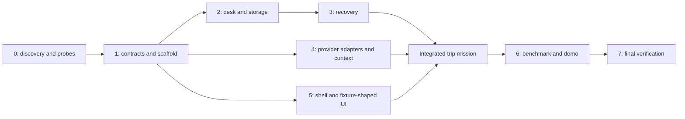

# Dead Reckoning: executable implementation plan

**Status: planning complete; application implementation not started by this planning task.** This document turns the [adoption design](../integration/DEAD_RECKONING_BUILD_PLAN.md) into ordered work packages. Read [AGENTS.md](../../AGENTS.md), [contracts](CONTRACTS.md), and [validation/demo specification](VALIDATION_AND_DEMO.md) together.

The deliverable is a trip mission agent that survives a worker crash after a simulated ferry reservation commits, reconciles the receipt, discovers a campsite closure, repairs the itinerary, and preserves accessibility/budget while bounding model context. OpenBot is the main console/AG-UI host. OpenMuse contributes task, guard/checkpoint, and approval patterns. RawTree, Nimble, and local Liquid supply the core sponsor integrations; OpenAI Responses supplies the planner; Intelligence supplies OpenBot conversation infrastructure.

## Phase 0 — documentation discovery and dependency proof

### Completed source discovery

Three discovery teammates inspected APIs, source integration points, and verification patterns. These are documentation findings, not successful account or service tests.

| Area | Allowed interface / source pattern | Read before coding |
|---|---|---|
| RawTree | Direct table insert, read-only query, parsed row-count acknowledgement | [brief, insert/query examples](../briefs/rawtree-tinybird.md); [OpenAPI](../sponsors/rawtree-openapi.json), paths `/v1/tables/{table}` and `/v1/query` |
| Nimble | Extract with CSS parsing; driver lookup; domain-health check | [brief](../briefs/nimble.md), lines 177–199 and 333–342; [OpenAPI](../sponsors/nimble-openapi.json) |
| Liquid | Local OpenAI-compatible chat endpoint; schema/grammar constrained generation | [brief](../briefs/liquid.md), lines 77–104 and 192–224; exact llama.cpp request shape remains a smoke-test gate |
| OpenAI | Responses with explicit input, `store:false`; preserve required output items inside an ongoing episode | [conversation state](../openai/conversation-state.md), especially full output-item preservation; current official docs when selecting model/tool schema |
| OpenBot remote agent | YAML `type: remote-ag-ui`, endpoint, exact local allowlist | [agents.yaml](../../reference/openbot/examples/fintech/agents.yaml); [tenant loader](../../reference/openbot/server/src/tenant-package.ts) |
| OpenBot UI extension | Compiled `GALLERY` export plus catalog announcement/eligibility | [registry](../../reference/openbot/app/src/lib/copilot/gallery-registry.ts); [gallery tools](../../reference/openbot/app/src/lib/copilot/gallery-tools.tsx); [component store](../../reference/openbot/server/src/components/store.ts) |
| OpenBot auth | `requireUser` route mounting; `context.var.actor` | [server app](../../reference/openbot/server/src/app.ts); [guards](../../reference/openbot/server/src/auth/guards.ts) |
| AG-UI transport | `RunAgentInput`, `EventEncoder`, valid run/text/tool events | [TypeScript endpoint example](../../reference/openbot/examples/langgraph-bot/src/index.ts); copy protocol handling, not its full-history reducer |
| OpenMuse task contract | `TaskContext.signal/guard/checkpoint/event`, typed task/evidence/status | [worker](../../reference/openmuse/apps/server/src/engine/worker.ts), lines 12–22; [domain](../../reference/openmuse/packages/domain/src/agent.ts) |
| OpenMuse action approval | Exact-operation hash, expiry, ownership, claim and unknown outcome | [actions](../../reference/openmuse/apps/server/src/actions.ts), lines 31–190 |
| Behavioral test patterns | Lease guards, approvals, channel refresh, real subprocess kill mechanics | [validation reference map](VALIDATION_AND_DEMO.md) |

Pinned references: OpenBot `3c73cf00efba46122dfd0447485e2b61f1d6a2cd`; OpenMuse `f5534c77a8c8740cf792ca73b1f7737829fb7518`. Preserve source pins and MIT notices when copying code. No reference repo is a published drop-in task-kernel dependency.

### P0 work packages still required

**P0.1 Environment:** verify Bun 1.3.14, working PostgreSQL/Docker or equivalent existing Postgres, and local inference hardware. Last observed Bun was 1.3.2; do not assume it changed. Do not upgrade unrelated global tools without scope. Record versions and errors without secrets.

**P0.2 Credentials:** verify backend access to RawTree, Nimble, OpenAI and managed Intelligence. Local Liquid requires downloaded model weights and a working server. Do not infer readiness from an environment variable merely existing. Hosted Intelligence requires API URL, gateway WebSocket URL and project key; the separate self-host license token is optional for managed service.

**P0.3 Live API probes:** one isolated RawTree insert/query/visibility check; one Nimble extraction of the chosen public fixture route or a known page; one schema-constrained Liquid response; one Responses structured decision; one OpenBot agent response. Use a disposable probe namespace. Record provider IDs, latency, shape and missing capabilities.

Before the OpenBot probe, perform the minimal source export and loopback patch from P1.1/P1.1a. This bootstrap prerequisite can happen during Phase 0; do not start an unmodified single-user reference server on its wildcard defaults merely to satisfy the gate. Full domain/scaffold work still follows the dependency proof.

**P0.4 Decide the planner model and pin dependencies:** select an available model through current official docs and a small fixture test. Use that same model/config in both benchmark arms. Validate the installed llama.cpp JSON-schema request shape and response usage fields; do not copy sampling parameters from an unrelated MLX example.

**Exit gate:** working service probes or explicit blockers/fallback modes in [WORKLOG.md](WORKLOG.md). OpenBot startup has a 30-minute event-window limit. If it blocks, continue the core service and standalone board; record that full OpenBot adoption is deferred. Never silently report the fallback as the integrated result.

**Anti-pattern guards:** no fake project key; no assumption an in-process test proves SIGKILL recovery; no schema guessed from SDK method names; no real booking APIs or payment credentials.

## 1. Final implementation decisions

1. Trip domain and the independent simulated desk are fixed for MVP. The earlier GPU Sentinel draft is historical.
2. One DR control process serializes mission mutations. It owns a killable child per mission and enforces a single active child. During the live demo, allow only one active mission globally; benchmark arms execute sequentially when sharing local inference hardware.
3. The control actor is the sole RawTree writer for canonical state. The worker submits typed transitions and performs validated sensing/planning/effects. This makes approvals and cancellation serialize with worker progress.
4. RawTree checkpoints/events are the mission authority. The surviving control process's acknowledged watermark is operational metadata, not an alternate store of mission facts.
5. OpenBot is exported into `apps/console` as an attributed source snapshot. New domain/services form a separate small Bun workspace. Keep both lockfiles independent.
6. OpenMuse's generic contracts and selected logic are adapted into `packages/task-kernel`. Do not copy its SQL Store or three-concurrent-task scheduler as a RawTree adapter.
7. Canonical mission data travels over authenticated HTTP. SSE/AG-UI only reports work; socket closure does not cancel a mission.
8. The first planner interface is a structured decision per iteration. A multi-call tool loop is optional and must preserve required call/output items within a bounded episode.
9. Context cap is initially a 6,000-token planner-input target. Pin overflow blocks; it never weakens constraints. Total metrics include curator and gateway overhead separately.
10. The minimum proof is real process termination plus source revalidation and measured repeated context management. A good-looking chat transcript is insufficient.

## 2. Repository and ownership map

All paths in this tree except the existing references/docs are proposed. New scripts named later must be implemented before use.

```text
AGENTS.md
package.json                         # new core workspace; excludes apps/console and reference
bun.lock                             # core workspace only
packages/
  mission-domain/src/                 # schemas, events, reducer, invariants, hash, API view
  task-kernel/src/                    # OpenMuse-derived guard/checkpoint/approval contracts
services/
  control/src/                       # config, HTTP routes, mission actor, supervisor, projection
  runner/src/                        # episode loop, recovery, context, provider adapters
  world/src/                         # SQLite ledger, fixture sources, public feed, operator routes
apps/
  console/                           # exported OpenBot source, separate lockfile/workspace
  fallback/                          # small optional React board using the same HTTP contract
bench/                               # fixtures, paired runner, oracle, metrics report
scripts/                             # doctor, dev lifecycle, schemas/client generation, verification
tests/{unit,integration,recovery,e2e}/
artifacts/                           # ignored local raw runs/recordings; sanitized published evidence elsewhere
docs/implementation/
  IMPLEMENTATION_PLAN.md
  CONTRACTS.md
  VALIDATION_AND_DEMO.md
  AGENT_TEAM_PLAN.md
  WORKLOG.md
THIRD_PARTY_NOTICES.md
```

This refines the adoption plan's single `services/dead-reckoning` placeholder into separate control and runner packages so the kill boundary is obvious. It does not add a second scheduler.

Owner A: domain/task kernel/control/runner recovery. Owner B: RawTree adapter/projections/desk/fixtures. Owner C: Nimble/Liquid/planner/context/benchmark oracle. Owner D: console/API client/mission board/demo assets. With three coding agents plus an orchestrator, give A to the orchestrator and delegate B/C/D; narrow work further when dependencies are not yet frozen. One owner edits shared schemas; others propose changes through that owner.

The [Claude Code team plan](AGENT_TEAM_PLAN.md) maps these owners to Opus 5.5, three Sonnet 5 builders and a rotating Fable 5 critic, with named tasks and evidence gates. A owns the runner entrypoint, recovery loop, serialized actor and revision/watermark state; B owns the storage adapter and replay implementation; C owns provider/context/fact/planning modules called by A and the independent benchmark oracle. D owns the OpenBot-side identity verifier; A owns the DR-side verification call and authorization. The guide's narrower file boundaries govern parallel edits. A reviewer does not edit the artifact it is reviewing.

## Phase 1 — scaffold, source adoption and contracts

**P1.1 Source export:** create a new empty `apps/console`, export the pinned OpenBot tree using `git archive`, preserve its hierarchy and LICENSE, and record the SHA. Keep ignored `reference/` clones untouched. Do not introduce nested `.git` metadata or replace the user's repository.

**P1.1a Local listener patch:** in the exported copy, change `app/vite.config.ts`'s shared dev/preview `host` from wildcard `::` to `127.0.0.1` and set the API proxy target to the same loopback address. Add explicit `hostname: "127.0.0.1"` to `server/src/index.ts`'s Bun `serve` call. The pinned startup log's localhost URL is not a binding control. Verify listening sockets for both ports before single-user use; keep every new core service loopback-bound too. Do not change the reference source or expose the entire world service through the public fixture tunnel.

**P1.2 Core workspace:** create manifests for domain, task kernel, control, runner and world; choose pinned compatible TypeScript/Zod/HTTP dependencies after inspecting actual package types. Set Bun 1.3.14. Configure typechecking and formatting for new code only, retaining upstream console checks separately.

**P1.3 Typed contracts:** implement [CONTRACTS.md](CONTRACTS.md) as discriminated schemas and pure reducers. Implement the versioned canonical argument serializer, exact approval-to-commitment binding, command deduplication, revision validation, allowed transitions and serializable mission snapshots. Include `pausing` and the orthogonal reconciliation status; explicit fixture-booking authorization is separate from optional per-action approval. Build schemas before service modules.

**P1.4 OpenMuse adaptation:** extract `TaskContext` concepts and action-binding logic with attribution. Replace `checkpoint(Partial<AgentTask>)` with a typed domain-transition submission. `guard()` checks active generation, cancellation and ownership. Record which lines/patterns came from upstream and what changed; do not leave mail/calendar or Google connection types in the DR kernel.

**P1.5 Configuration/examples:** implement one config module with validated URLs/ports/budgets/model choices. Generate empty `.env.example` files and allowlist only those examples in `.gitignore`; the existing `.env.*` ignore rule currently hides them. Keep real keys ignored. Add `THIRD_PARTY_NOTICES.md` and a proposed-versus-implemented README.

**Evidence:** manifests/typecheck pass; invalid record/transition tests pass; export SHA and license notices match; reference clones stay clean. No runtime endpoint should yet claim bookings work.

**Guards:** no blind pnpm/Bun lockfile merge, no casts around unvalidated data, no arbitrary merge/JSON patch into mission state, no unapproved broad workspace changes.

## Phase 2 — simulated world and durable storage

**P2.1 Desk:** implement the four SQLite tables and `POST /book` plus `GET /actions/:key`. Validate explicit batch/arm/mission namespace and recompute the canonical argument hash. Inside the transaction, return an existing identical terminal outcome before checking today's world; only new keys run current-world checks. Transactionally enforce unique action key and argument binding. Record expected business rejections without rolling back their attempts. Return unavailable distinctly from absent.

**P2.2 World feed:** render a stable HTML table with explicit site ID, status, accessibility, dates/price and notice fields. Add the operator editor and fixture clock/version. Expose only the read-only feed through a route-restricting proxy or separate feed listener for Nimble; never tunnel the whole desk port. Operator write controls need the operator token and remain local in the MVP.

**P2.3 RawTree adapter:** copy the documented HTTP insert/query shapes. Validate HTTP success, insert count, visibility and query response. Add bounded backoff with deadline, honor rate-limit retry guidance, and preserve a parent-owned pending append descriptor before ambiguous writes. Resolve that descriptor before advancing/reusing its revision. Critical writes bypass any batching/telemetry buffer.

**P2.4 Projection:** implement event deduplication, monotonic revision ordering, deterministic checkpoint identity, complete checkpoint restore and gap detection. Reject differing snapshots at the same revision; restore only checkpoints at/below the resolved watermark and verify the boundary event. RawTree SQL stays in tested fixed templates. Publish immutable raw evidence before canonical references that promise recall; include bounded provenance in the event itself. Mirror analytical data only after canonical transition writes; mirror failure cannot invent a successful mission transition.

**P2.5 Fixture isolation:** use independent batch/arm/mission namespaces and deterministic fixtures from contracts. Reset creates a new namespace. Retain old proof for debugging.

**Evidence:** duplicate requests yield one reservation; conflicting args rejected; current-world preconditions checked inside desk transaction; delayed/partial/ambiguous RawTree cases block correctly; tied timestamps do not change projection order. Run one live RawTree probe in addition to deterministic adapter fakes.

**Guards:** desk never trusts model-supplied price/status; query `LIMIT` never silently truncates restore; domain health is not a booking oracle; shutdown flush is not durability for SIGKILL.

## Phase 3 — command actor, process ownership and recovery

**P3.1 Mission actor:** implement a per-mission serialized command queue, authenticated ownership check, duplicate-command handling and expected-revision conflicts. The actor assigns revisions and acknowledges a transition only after the storage gate. Limit backlog and reject commands clearly when storage is unavailable.

**P3.2 Supervisor:** spawn the runner with a specific mission ID and execution generation; track child handle/PID/exit signal. Bind its typed transition/dispatch requests to a parent-owned IPC channel. Pass an explicit allowlist of child environment variables; internal proxy/verification, operator, RawTree and Intelligence credentials stay out of the child. Only kill a child owned by this supervisor. Resume refuses an active previous child; repeated accepted Resume returns the existing run. Close chat/window without killing the child. Parent-loss recovery is outside MVP: a fresh parent without ownership/watermark metadata refuses to resume that existing mission with `CONTROL_RECOVERY_REQUIRED`. Stop old owned processes and use a fresh isolated namespace for another demo; do not claim automatic orphan recovery.

**P3.3 Recovery sequence:** first resolve any parent-retained pending RawTree append by original event ID/revision/hash, advancing the watermark only after visibility. Continued uncertainty blocks Resume; do not drop it when clearing the projection cache. Then load checkpoint/tail, reconcile pending keys with desk, restore confirmed outcomes, mark needed facts stale and enter revalidation. Do not invoke the planner before reconciliation resolves or blocks the relevant commitment. During pausing/cancelling, apply the lookup-only recovery policy from contracts; only explicit Resume from pause can restore active retries.

**P3.4 Intent/effect protocol:** validate → write visible intent → actor-serialized durable dispatch claim → desk call → outcome → checkpoint. Implement `DISPATCH_CLAIMED` and define cancellation order as in contracts: cancel-before-claim prevents dispatch; claim-before-cancel is already in flight. Implement explicit `unknown` outcome on timeout. Record a late confirmed receipt even if pause/cancel arrived; do not lose evidence because its old expected plan revision differs.

Do not promise that Cancel prevents the original runner from sending an already-claimed attempt. After that runner exits, pausing/cancelling permits lookup only, not resend. An absent/unknown lookup ends bounded polling with an explicit reconciliation block, not false cancellation success. Test both claim→cancel→send and claim→kill-before-send→cancel→absent paths.

**P3.5 Fault injection:** operator arms `after_intent`, `after_desk_commit`, or `after_receipt`; the default demo hook is after desk commit. The hook terminates the actual runner process. Parent waits for manual Resume during the interactive demo. Never let a model invoke this endpoint.

**Evidence:** primary process-kill test passes with actual new PID and one desk effect; all three crash boundaries pass; unknown lookup blocks; browser disconnect leaves mission alive; cancellation cannot erase an already committed effect.

**Guards:** no duplicate scheduler, no process-local receipt cache as proof, no regenerated action key on retry, no automatic compensation for an irreversible booking.

## Phase 4 — sensing, curator, planner and bounded context

**P4.1 Nimble adapter:** start with direct HTTP or an installed SDK whose types have been checked. Use known source URLs, stable CSS extraction for the operator feed and one official page. Parse the actual status/data union, retaining `task_id`; optional timing/driver fields may be absent. Represent live/cached/fixture/replay distinctly.

**P4.2 Fact lifecycle:** implement source/scope/time validation, stale marking on applicable epoch/TTL boundaries, versioned replacement/conflict, and dependency invalidation. Refresh only evidence remaining steps require. Source failure blocks those steps without asserting the resource itself closed.

**P4.3 Liquid:** pin model artifact and llama.cpp build used. Verify strict JSON decoding syntax with an invalid-output probe. Separate fact-proposal and context-curation calls so each has a narrow schema. Code validates all outputs regardless of grammar. Log rejection and actual call duration. Retry at most a configured bound; any rule fallback is visibly a fallback.

**P4.4 Context composer:** derive input from immutable active constraints, unresolved commitments, compact receipts, current relevant facts and the plan frontier. Include system/tool/schema overhead. Archive raw observations outside input; bounded recall reintroduces cited excerpts. Overflow of pinned material blocks rather than drops.

**P4.5 Responses planner:** use the chosen explicit model with `store:false`. Begin with one structured decision per iteration; code dispatches validated actions. Keep provider retries distinct from business-action retries. If adding function calls, test matching tool outputs and complete output/reasoning item preservation within each bounded episode. A completed episode can be replaced by canonical state for the next one.

**P4.6 Independent verdict:** calculate constraints, commitments, freshness and itinerary completeness without trusting model prose. A valid plan with pending bookings is not `all booked`; only the corresponding completed workflow gets the full success label. Infeasible accessible replacement is a legitimate blocked outcome.

**P4.7 Memory trace:** implement the fixed same-mission observation/curation/recall trace in [validation section 6a](VALIDATION_AND_DEMO.md#6a-required-memory-workload-and-liquid-causality). Persist composition manifests for successive real planner inputs. A positive live Liquid-authored edit must change the next prompt's item set while preserving pins and durable recall; a decorative proposal or rule fallback does not satisfy this gate.

**Evidence:** closure produces a new fact version and affected-step repair; ferry receipt retained; inaccessible candidate rejected; malformed Liquid patch cannot change state; input cap measured across repeated calls; no-valid-alternative fixture blocks clearly.

**Guards:** no confidence-as-truth rule, no generic SQL tool, no unrestricted AG-UI state-delta mutation, no raw transcript sent as canonical planner memory, no fabricated latency/token usage fields.

## Phase 5 — OpenBot connection and mission console

**P5.1 Tenant:** copy the fintech tenant structure, retaining required brand/agents/channels/model/knowledge files. Configure one `remote-ag-ui` DR agent and exact local endpoint allowlist. Disable arbitrary generated UI for this fixed-evidence demo. Do not depend on the managed-agent harness's model variables controlling the DR runner.

**P5.2 Authenticated proxy:** add `server/src/dead-reckoning/routes.ts` and mount browser routes with the existing `requireUser` pattern. Forward trusted identity and the server-to-server secret; DR verifies owner access. Provision matching `DR_INTERNAL_TOKEN` only in OpenBot and DR control. Add a separately service-authenticated `POST /api/dead-reckoning/internal/verify-run` route for the AG-UI path: run OpenBot's existing `readRunAssertion` helper inside OpenBot, retaining its signing key there. Check DR Bot identity, actor access and run/thread binding. Never trust an owner ID supplied by the model/browser alone. Keep the custom service loopback-only during MVP.

**P5.3 AG-UI adapter:** copy the published event encoder usage from the TypeScript example. Validate incoming request and verify its opaque `forwardedProps.openbotRun` through the new internal route before mission access. Then map the authorized request to an owner-scoped deduplicated command and return accepted mission ID/explanation using a complete run lifecycle. Persist/reuse the original client command or message identity across transport retries; a new AG-UI run ID alone must not create a second business intent. Accepting/finishing a chat run does not mean the mission is completed. Do not copy the sample's full-history model reducer or frontend-controlled effect execution into the mission loop.

**P5.4 Mission route:** add the route under `_authed/_app/missions/$missionId.tsx`. Build `MissionBoard`, `ConstraintStrip`, `RouteMap`, `ReceiptRail`, `WorkingContextTray`, `EvidenceDrawer`, `ProofPanel`, and `OperatorStatus`. Start with regular React components and a typed API client. Generate the frontend view types from the canonical contract during build; do not manually maintain an incompatible second domain schema.

**P5.5 Canonical refresh:** query the snapshot; poll while active and refetch after commands/reconnect. Ignore older revisions. SSE can accelerate refresh but is never replayed as truth. Show source unavailable, worker stopped, reconciling and blocked states explicitly.

**P5.6 Optional gallery:** export a `GALLERY` mission-card entry using the existing `GalleryComponent` type; args are mission ID, not model-invented receipt values. Verify catalog announcement, publication and per-agent eligibility. In this pin, first announcement can auto-publish; explicit per-bot exclusions and any data-function grants still apply. Do not assume manual publication is always required or that a file alone proves availability.

**Evidence:** source console boots; DR is reachable through configured transport; authenticated mission route works; unauthorized mission access denied; refresh after worker crash shows durable state; gallery card if enabled hydrates real data; receipt rows match desk records.

**Guards:** React Native screens are not directly imported; do not hand-edit generated route trees; API authority is independent of event rendering; internal worker calls do not automatically inherit OpenBot gateway policies.

## Phase 6 — controlled comparison and demo readiness

**P6.1 Fixture runner:** implement independent reset/namespace/clock handling for each arm. Both get the same planner, evidence, candidate set, receipt lookup, permissions, desk idempotency and crash schedule. Use deterministic provider stubs only for tests; label live benchmark paths separately.

**P6.2 Comparator:** implement the fixed checkpoint/summary policy in [validation section 6b](VALIDATION_AND_DEMO.md#6b-frozen-primary-comparator-policy), including checkpoint cadence, reconciliation/revalidation and summary trigger. Freeze policy, prompts, token thresholds and fixture hashes before measured runs. A raw append-only transcript can be an additional labeled ablation. Do not force baseline failure or remove receipt lookup. Keep comparison architecture and model prompts in the submitted artifact.

**P6.3 Measurements:** collect actual provider usage, separate curator/transport totals, model configuration, repeated calls, request/effect counts, validity/block reason, source freshness and restore time. Begin with six paired missions, target twelve if stable. Preserve failures/ties and real elapsed duration.

**P6.4 Demo:** use the exact choreography and evidence checklist in [VALIDATION_AND_DEMO.md](VALIDATION_AND_DEMO.md). Complete one uncut process-crash recording. Clearly label simulated bookings, operator closure and any cached/replay evidence.

**P6.5 Submission:** README setup, code-origin mapping, credentials-by-name, schema/protocol, actual results, known limitations, shareable video and reproducible command. Use event rules actually published; neither MIT reuse nor a new repository alone establishes competition eligibility.

**Evidence:** frozen paired batch export plus fresh interactive mission; no displayed metric without a source run; public links checked if publishing is within the task's authorization.

## Phase 7 — final verification and handoff

1. Inspect actual diff and confirm each implemented API matches its documented/installed interface.
2. Run new-code typecheck, lint/build and behavior tests. Run the changed console's relevant checks and targeted upstream regression tests.
3. Run a real subprocess recovery test and one real-provider smoke path; report skipped live checks separately.
4. Search for anti-patterns: timestamp-only authoritative projection, buffered critical intent, arbitrary state patch/SQL, regenerated retry keys, full-history DR planner input, fake metrics, and unlabelled replay. Search matches trigger review; a grep alone is not a correctness proof.
5. Confirm no secrets, model weights, local databases, unrelated modifications or reference-clone changes entered the diff. Preserve attribution.
6. Update WORKLOG with commands, exit status, evidence IDs, remaining gaps, and implemented versus deferred scope.
7. Report completion only when the requested implemented scope passes. If fallback UI is used, say OpenBot integration is deferred; if live services were unavailable, do not call the live path verified.

## 3. Dependency order and merge discipline



Independent adapter/UI work may proceed after contracts freeze; final integration waits for the recovery protocol. No teammate edits another owner's files without coordination. Prefer small reviewable batches: contracts; desk/storage; recovery; sensing/context; console; benchmarks. Each batch includes relevant tests and evidence. Do not wait until the last hour to connect all sponsors.

## 4. Commands to create versus existing commands

These **new root scripts are proposed**; Phase 1 creates them with explicit scope and nonzero failure exits:

| Proposed command | Required behavior |
|---|---|
| `bun run check:types` | Typecheck new core workspace |
| `bun run check:lint` | Check new code without reformatting reference/vendor trees |
| `bun run test:unit` | Pure schemas/reducers/validators/context/keys |
| `bun run test:integration` | Real local desk/control plus deterministic provider/storage adapters |
| `bun run test:recovery` | Actual child-process kill and recovery fixtures |
| `bun run test:e2e` | Mission browser walkthrough against controlled backend |
| `bun run test:smoke:live` | Explicit credential-requiring provider probes; fails clearly if required service unavailable |
| `bun run bench:paired` | Fixed paired fixtures; outputs versioned metrics and trace references |
| `bun run demo:doctor` | Readiness checks only; reports presence/status, never credential contents |
| `bun run dev:core` | Starts local core services; owns child handles; preserves manual crash/resume behavior |

Existing OpenBot commands, run from exported `apps/console`: `bun install --frozen-lockfile`, `bun run typecheck`, `bun run build`, `bun run lint`, `bun run test:ci`. App/API dev is `bun run dev`; minimal PostgreSQL/migration steps remain environment-dependent. Integration tests use a dedicated `TEST_DATABASE_URL`, not the application database.

OpenMuse reference commands are `pnpm test`, `pnpm typecheck`, `pnpm lint`, and `pnpm build:server`; use only when changing/evaluating that reference stack deliberately. Do not install/start the whole OpenMuse product merely to validate a small extracted contract.

## 5. Schedule, priorities and open decisions

Full integration estimate: two to three focused development days with four contributors and working accounts; this is a planning estimate, not a measured build duration. The 5.5-hour schedule is an aggressive event cut, not an assurance that a fresh team can implement and verify every phase. If provider/shell probes miss the first gate or real recovery misses the 2:30 gate, switch to an explicitly narrower deliverable and record unmet claims; do not label mocks/fallbacks as completed sponsor integration. Preserve the memory trace and actual crash proof before adding comparison polish.

| Event elapsed | Required gate |
|---|---|
| 0:00–0:30 | Provider probes and shell go/no-go; shared contracts |
| 0:30–1:30 | Desk, RawTree intent/restore, worker ownership; provider adapters and UI in parallel |
| 1:30–2:30 | First real crash → changed world → reconcile → repaired/blocked mission |
| 2:30–3:30 | Bounded context proof, paired fixtures, failures fixed |
| 3:30–4:15 | Feature freeze; evidence export; recording and README in parallel |
| 4:15–4:45 | Final rehearsal, video upload and setup docs |
| 4:45–5:00 | Submit by internal 4:00 PM Pacific target for an 11:00 start |
| 5:00–5:30 | Buffer before advertised 4:30 PM cutoff; no new subsystems |

Cut order: gallery embedding, map animation, broad source discovery, automated compensation, extended benchmark, browser/computer takeover. Keep recovery, required sponsor paths, explicit persist/discard behavior, honest metrics and clear provenance.

Open choices to resolve through Phase 0 evidence: planner model ID; installed llama.cpp strict-output syntax and context size; RawTree observed visibility latency and bounded timeout; official source selectors; Intelligence entitlement; suitable tunnel access; chosen type-generation tool. Routine implementation choices do not require a new user approval; record them and proceed within the authorized scope. These unresolved runtime facts must not be described as already tested.
