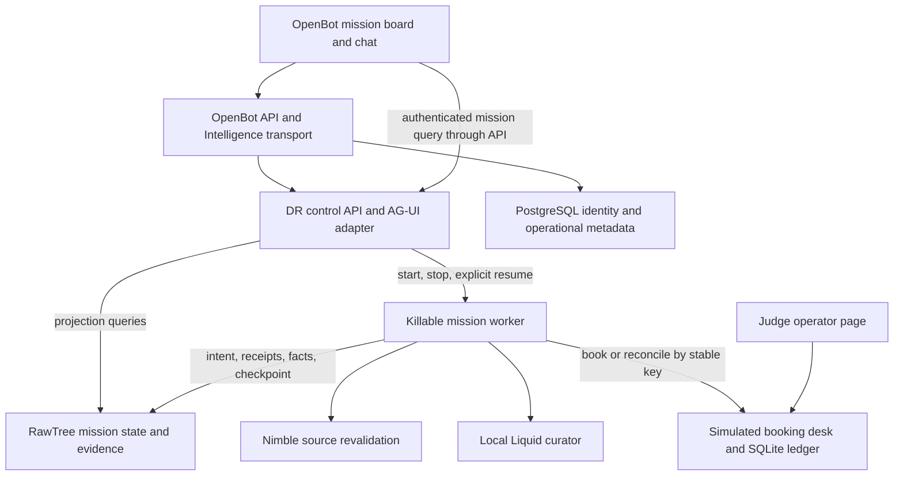

# Dead Reckoning: OpenBot + OpenMuse implementation and demo plan

Reviewed 25 September 2026. This is a source-backed implementation plan, not a completed integration. Three teammates independently reviewed OpenMuse, OpenBot, and demo failure modes; the synthesis below makes the final architectural choices. Source commits and verification limits are in [SOURCE_PINS.md](SOURCE_PINS.md).

## 1. The decision

**Build one Dead Reckoning mission console on OpenBot. Adapt OpenMuse's task lifecycle, checkpoint guards, approval binding, and task-detail interaction patterns into a separate mission service. Keep the mission runner independently killable.**

The core demonstration is a trip-planning agent that keeps a ferry reservation, discovers a campsite has closed, preserves a wheelchair-accessibility constraint, and repairs the remaining itinerary after its process dies. Its working prompt remains bounded while its evidence and history accumulate outside the prompt.

OpenBot gives us the web application, agent registration, conversation surface, component catalog, and access-control plumbing. OpenMuse gives us concrete implementations to learn from and selectively port for durable tasks, uncertain actions, progress, and approvals. The new contribution is the typed mission state, context-edit policy, intent/reconciliation protocol, source revalidation, and measured comparison.

Use **exactly three sponsor integrations: RawTree/Tinybird, Nimble, and Liquid AI**. CopilotKit Intelligence, PostgreSQL, Bun, and any chosen planner provider remain real infrastructure dependencies; they are not extra sponsor integrations. Disclose them. There is no promise that this project wins, but this combination produces a strong, inspectable demonstration of the actual hackathon theme.

Do not merge the two full applications. Their frontends, package managers, persistence layers, and background workers differ. Running both products plus their optional browser/computer stacks would spend the build on integration rather than the new architecture.

### Source and specification priority

The existing [FINAL_PROJECT.md](../FINAL_PROJECT.md) and [WIN_PLAN.md](../WIN_PLAN.md) supply the trip domain and sponsor concept. This document supplies the integration decisions and corrects several implementation details: source freshness is not model confidence; a queryable receipt is distinct from a chat message; query visibility must be checked; the crash must be armed before the effect; benchmark numbers must be measured. Older `docs/plan/` drafts explore different domains and stronger claims. They were left unchanged and are not the build specification.

## 2. What each repository actually contributes

| Capability | OpenBot contribution | OpenMuse contribution | New Dead Reckoning work |
|---|---|---|---|
| Judge-facing web app | React/Vite shell, channels, chat, tenant branding | Task detail and worker-state UX patterns | Mission board, route, memory tray, proof panel |
| Agent connection | Registered `remote-ag-ui` endpoint, runtime transport | AG-UI conversation and tool-card examples | Small AG-UI command adapter, independent durable runner |
| Task execution | Operational queue/lease examples | `AgentTask`, `TaskWorker`, guard/checkpoint and event patterns | One mission owner, typed transitions, explicit recovery phases |
| Approval | Registered decision-component rendering | Hash/version/expiry-bound action approval and `outcome_unknown` | Durable mission approval, exact action scope, stale-approval rejection |
| State | PostgreSQL identity, grants, audit, operational metadata; Intelligence conversations | PGlite/PostgreSQL task records | RawTree canonical mission state and cold evidence |
| Reliability | Reconnect/refetch, access policy and audit | Lease recovery and interrupted-action treatment | Write-ahead intent, desk reconciliation, freshness gate, bounded prompt |

OpenMuse's generic model-tool cache records a result after the operation. Its leases can restart a task, but cannot alone resolve an operation that committed externally before its result was recorded. OpenBot's queue similarly delivers work at least once. These are useful foundations, not the missing business protocol. Sources: [OpenMuse worker](https://github.com/CopilotKit/openmuse/blob/f5534c77a8c8740cf792ca73b1f7737829fb7518/apps/server/src/engine/worker.ts), [model execution](https://github.com/CopilotKit/openmuse/blob/f5534c77a8c8740cf792ca73b1f7737829fb7518/apps/server/src/engine/model.ts), [OpenBot work queue](https://github.com/CopilotKit/openbot/blob/3c73cf00efba46122dfd0447485e2b61f1d6a2cd/server/src/work/queue.ts).

### OpenMuse: concrete reuse map

1. **Task vocabulary:** adapt `packages/domain/src/agent.ts` into the DR task kernel. Keep explicit status, plan steps, evidence references, attempts, and question/approval states. Replace loosely typed mission state with our schema. Add `reconciling`, `revalidating`, and `blocked` phases as domain states, rather than pretending every restart is merely `running`.
2. **Guard/checkpoint contract:** extract the framework-neutral portions of `apps/server/src/engine/worker.ts`. A tool/effect must check that its worker still owns the mission and that cancellation has not occurred. A checkpoint writes acknowledged domain state. Do not directly replace the SQL CAS Store with a RawTree query: an analytical query is not CAS.
3. **Action review:** adapt `apps/server/src/actions.ts`'s exact-operation, hash, expiry, and uncertain-outcome pattern. Bind approval to `missionId`, plan revision, action arguments, actor, and expiration. A resumed card cannot approve a different plan or trigger the operation twice.
4. **Task controls:** borrow API semantics and progress vocabulary from `engine/service.ts` and `engine/routes.ts`. Keep pause/resume/cancel explicit. A disconnected chat stream is not a cancellation command.
5. **Task-detail UI:** recreate selected `apps/mobile/src/agent-ui.tsx` behaviors in React DOM: current step, why waiting, evidence, approval, failure reason, and artifacts. The source UI uses React Native; do not import those components directly into Vite.
6. **Snapshot refresh:** port the idea from `agent-workspace.tsx`: fetch canonical state, refresh after mutations, reject late snapshots. This is more dependable than reconstructing the mission from browser-local event history.

Do not run the OpenMuse server, browser worker, computer image, or mail/PDF workflows in the chosen topology. If separately evaluating its standalone task worker, use PostgreSQL: its separate-worker entry point rejects the embedded PGlite configuration. See [actions.ts](https://github.com/CopilotKit/openmuse/blob/f5534c77a8c8740cf792ca73b1f7737829fb7518/apps/server/src/actions.ts), [UI](https://github.com/CopilotKit/openmuse/blob/f5534c77a8c8740cf792ca73b1f7737829fb7518/apps/mobile/src/agent-ui.tsx), and [worker entry](https://github.com/CopilotKit/openmuse/blob/f5534c77a8c8740cf792ca73b1f7737829fb7518/apps/server/src/worker-entry.ts).

### OpenBot: concrete reuse map

1. Keep the `app/` and `server/` hierarchy and root lockfile together. Customize the tenant package, not dozens of unrelated built-in coworkers.
2. Register one DR remote agent using the existing YAML registry. Use the server's configured transport and identity boundary; do not impersonate the managed-agent endpoint or bypass its checks.
3. Add a dedicated mission route with a canonical API query. Make it the main screen for the demo; chat is an input/explanation surface beside it.
4. Optionally add a compiled gallery card that opens/embeds the mission using only a `missionId`. `gallery-registry.ts` discovers `GALLERY` exports; the component also needs publication and a grant to the DR bot. A file appearing on disk alone does not make it available to the agent.
5. Use a registered decision component for approvals, backed by the durable DR approval API. The React response itself is not the authoritative approval record.
6. Reuse audit and reconnect design patterns. OpenBot channel events are hints; after reconnect the board refetches state. Do not assume arbitrary AG-UI custom state/events automatically render in the existing chat.

Do not enable browser automation, desktop control, Google integration, bot creation, arbitrary generated JSX, or scheduled routines for the MVP. Those are impressive upstream features but do not strengthen this particular demonstration. Sources: [tenant example](https://github.com/CopilotKit/openbot/blob/3c73cf00efba46122dfd0447485e2b61f1d6a2cd/examples/fintech/agents.yaml), [gallery registry](https://github.com/CopilotKit/openbot/blob/3c73cf00efba46122dfd0447485e2b61f1d6a2cd/app/src/lib/copilot/gallery-registry.ts), [gallery registration](https://github.com/CopilotKit/openbot/blob/3c73cf00efba46122dfd0447485e2b61f1d6a2cd/app/src/lib/copilot/gallery-tools.tsx), [channel events](https://github.com/CopilotKit/openbot/blob/3c73cf00efba46122dfd0447485e2b61f1d6a2cd/server/src/channels/events.ts).

## 3. Runtime architecture and authority



There are four distinct authorities:

| Owner | Authoritative for | Must not be used to infer |
|---|---|---|
| RawTree | Mission constraints, facts, intent history, recorded receipts, checkpoints, context operations | Whether an unrecorded external booking succeeded |
| Simulated desk SQLite | Committed reservations, request attempts, authoritative fixture status | The agent's plan or reasoning |
| OpenBot PostgreSQL | Users, grants, channels, UI/control metadata, optional ownership leases | Mission facts or reconstructed evidence |
| CopilotKit Intelligence | Visible conversation/thread history | Current mission truth, effect success, planner context |

**One scheduler:** for the hackathon, the DR control process owns one child runner per active mission and refuses Resume until the prior child has exited. Port OpenMuse guard/checkpoint concepts into this runner. Do not simultaneously dispatch missions through OpenMuse TaskWorker, OpenBot routines, and the computer supervisor. A distributed/leased queue is a later extension, requiring fencing at the effect boundary as well as a lease.

The API and desk survive the crash. A worker restart clears in-process planner state and reconstructs the mission from RawTree, then reconciles against the desk. The browser can be closed and reopened without changing execution. Control requests are short: accept a mission command, return its ID, then let the board query progress. If an AG-UI stream ends, only observation ends; an explicit durable Cancel command controls the mission.

The custom AG-UI endpoint must not feed the entire received `messages` array into the planner. OpenBot may restore and forward a long conversation. Parse/deduplicate the latest authorized command, then construct a new bounded planner input from the mission projection. Measure gateway/history transport overhead separately; a bounded DR planner prompt does not make the entire hosted conversation storage or transport constant-sized.

## 4. Proposed project layout and integration seams

Everything below is proposed implementation work; only `reference/` and the research documents exist today.

```text
reference/openbot/                     # untouched pinned source
reference/openmuse/                    # untouched pinned source
apps/console/                         # licensed OpenBot source snapshot
  app/src/routes/_authed/missions/     # custom mission route
  app/src/components/dead-reckoning/   # board, receipt rail, memory tray, proof
  app/src/components/gallery/         # optional registered MissionCard
  server/src/dead-reckoning/          # authenticated proxy/control adapter
  examples/dead-reckoning/            # tenant package; retain expected files
packages/task-kernel/                 # attributed OpenMuse-derived types/guards
packages/mission-domain/              # schemas, transitions, validators, context policy
services/dead-reckoning/              # long-lived API plus killable runner entry
  src/control.ts
  src/ag-ui.ts
  src/runner.ts
  src/recovery.ts
  src/context.ts
  src/adapters/{rawtree,nimble,liquid}.ts
services/world/                       # separately running simulated desk and status feed
bench/                               # matched cases, baseline, metrics exporter
tests/recovery/                       # subprocess crash and invariant tests
THIRD_PARTY_NOTICES.md
```

Keep the vendored console's Bun workspace self-contained. Do not combine its lockfile with OpenMuse's pnpm workspace. New domain/service packages can use Bun 1.3.14 and TypeScript; extract only framework-neutral OpenMuse logic with explicit adaptations. Each reused substantial source file should retain attribution and identify its upstream commit. The parent repository tracks the snapshot as normal files, rather than accidentally nesting another `.git` repository.

Proposed API contracts:

| Endpoint | Role |
|---|---|
| `POST /ag-ui` | OpenBot transport adapter; deduplicated mission commands and explanations |
| `POST /missions` | Validate trip request, persist constraints, create mission |
| `GET /missions/:id` | Canonical revisioned snapshot used by the board |
| `GET /missions/:id/events` | Optional SSE hints; refetch snapshot on reconnect |
| `POST /missions/:id/resume` | Idempotent explicit restart after exit, not replay of transcript |
| `POST /missions/:id/approvals/:approvalId` | Decision bound to actor and expected revision |
| `POST /demo/:id/arm-crash` | Operator-only test hook; unavailable as a model tool |
| Desk `POST /book`, `GET /actions/:key` | Stable-key simulated action and authoritative reconciliation |
| Desk `GET /status.html`, `POST /admin/world` | Public read-only fixture feed and protected test editor |

The OpenBot server authenticates/authorizes mission access before proxying. The DR service validates every transition and all internal sponsor calls itself. OpenBot's gateway does not automatically govern HTTP requests made inside a separate custom worker. Mirror significant decisions into the UI audit, but do not present that as inherited enforcement.

## 5. Clone and boot sequence

The two repositories are already cloned and clean in this workspace. Their local HEADs matched GitHub HEAD during this review. For a fresh checkout, use these pins:

```sh
git clone https://github.com/CopilotKit/openbot.git reference/openbot
git -C reference/openbot checkout --detach 3c73cf00efba46122dfd0447485e2b61f1d6a2cd
git clone https://github.com/CopilotKit/openmuse.git reference/openmuse
git -C reference/openmuse checkout --detach f5534c77a8c8740cf792ca73b1f7737829fb7518
```

Do not rerun those clone commands over existing directories. At implementation time, create a fresh `apps/console` and export the pinned OpenBot tree with `git archive`; retain its LICENSE. Copy the selected OpenMuse source into the task kernel deliberately, with its MIT notice. Both licenses permit reuse subject to their notice requirements. They do not include a CopilotKit Intelligence deployment entitlement. Disclose upstream code versus newly built hackathon work and check the event's actual reuse rules; do not infer a ban merely from a requirement to start the submission repository at the event.

**First 30-minute gate:** prove credentials and integration seams before styling the app.

1. Align Bun to the repository's **1.3.14**. This machine currently has **1.3.2**, so startup compatibility is not established. The OpenMuse reference uses pnpm 11.19.0 and Node >=22; do not start that whole stack for this design.
2. Set up the console's `.env` locally from its example. Obtain the Intelligence project key using the documented CopilotKit login/project flow; do not put it in frontend variables. Preserve the required API and WebSocket URLs. Check model configuration and any built-in capability checks even though DR uses its own planner.
3. Start PostgreSQL, migrate, then start app/server without optional computer/bot containers. The following are a proposed minimal assembly of existing scripts, not a startup sequence tested by this review:

```sh
# From apps/console, after configuration and toolchain alignment:
bun install --frozen-lockfile
docker compose up -d postgres
bun run --cwd server db:migrate
bun run dev
```

The full documented `bash scripts/start.sh` path starts extra services. Use it only if deliberately evaluating the full upstream product. Minimal app/API startup still needs the correct configuration and database; it is not a no-credentials fallback.

4. Copy the fintech tenant package to `examples/dead-reckoning`, retaining valid brand, model, knowledge, channel, theme, and optional skills files. Replace the agent roster with one DR agent. The loader requires more than `agents.yaml`; see [tenant-package.ts](https://github.com/CopilotKit/openbot/blob/3c73cf00efba46122dfd0447485e2b61f1d6a2cd/server/src/tenant-package.ts).
5. Add the following registry entry and settings; the `DEAD_RECKONING_AG_UI_URL` name is new project configuration, while the endpoint type and allowlist are existing OpenBot features:

```yaml
agents:
  - id: dead-reckoning
    name: Dead Reckoning
    title: Trip Mission Control
    role_description: Start and inspect durable trip missions and explain their evidence.
    avatar_seed: dead-reckoning
    type: remote-ag-ui
    endpoint: ${DEAD_RECKONING_AG_UI_URL:-}
```

```dotenv
TENANT_PACKAGE_DIR=../examples/dead-reckoning
DEAD_RECKONING_AG_UI_URL=http://127.0.0.1:4400/ag-ui
AGENT_ENDPOINT_ALLOWED_HOSTS=127.0.0.1:4400
OPENBOT_GENERATIVE_UI=false
```

This address assumes server and DR API run on the same host. Container deployments need a reachable service address and matching exact allowlist. Do not use a broad private-host bypass. In single-user mode every visitor is an administrator: keep that console local and expose only the separate read-only status fixture route required for Nimble.

6. Prove a minimal registered-agent response, a mission query, one RawTree insert/read, one Nimble extraction, and one local Liquid JSON response. Record actual latency and errors. The account/service checks are still outstanding.
7. If the OpenBot shell gate fails after 30 minutes, build the same mission board as a small standalone React page while preserving the OpenMuse-derived task kernel. This is a fallback that postpones full OpenBot integration, not a claim that the integrated stack works. The core service contracts remain unchanged.

Suggested ports: console 3010, OpenBot API 3001, DR API 4400, desk 4401, Liquid 8080. Bind the local inference server explicitly rather than assuming a default port. All sponsor credentials stay in backend environment configuration. Store and show evidence IDs, never credentials.

## 6. Typed state, persistence, and context editing

Freeze these contracts before parallel coding:

| Record | Required information | Context rule |
|---|---|---|
| `Constraint` | Stable ID, type, value, user origin, revision | Pin active constraints; model cannot evict or weaken them |
| `Fact` | Stable key, value, source URL/ID, observed time, effective interval, status, supersedes | Keep current relevant version; stale versions cannot authorize an action |
| `Commitment` | Business action key, exact args hash, mission/arm, intent status | Pin unresolved intents until reconciled or explicitly blocked |
| `Receipt` | Desk key/ID, committed outcome, lookup provenance | Keep compact confirmed stub; archive verbose response |
| `PlanStep` | Dependencies on fact versions/constraints/commitments, status | Invalidate affected unfinished steps when dependencies change |
| `ContextOp` | Keep/evict/replace proposal, target IDs, reason, model version, validation outcome | Auditable, applied only by deterministic code |
| `Checkpoint` | Complete mission projection, revision, schema version, event high-water mark | Restore coherent state, never an accidental mix of partial rows |
| `Metric` | Batch, arm, mission, call, wall time, token source, errors | Raw measurement; no illustrative numbers in result UI |

Use one ordered single-writer event stream per mission. Assign stable event IDs and monotonically increasing revisions. Deduplicate replayed inserts by event ID in projections. Use revision ordering, not only `argMax(value, ts)`; wall-clock ties and skew must not pick the wrong fact. Keep a complete checkpoint in one logical record rather than implying atomicity across eight tables. Analytical tables can be derived for the proof view.

**RawTree is not a transactional booking database.** Await and validate the critical insert acknowledgement, including partial-insert failures. Check read-after-write visibility in the startup smoke test. After restore, wait within a bounded timeout for the required acknowledged records to be visible. If a coherent checkpoint/event range cannot be established, show `BLOCKED_STORAGE`; do not invent continuity from a local cache. The guaranteed demo scope is a single worker crash with the control plane and simulated desk surviving, not a proof against every distributed partition or total-machine loss.

Proposed working-context budget: **6,000 planner input tokens**, measured with the chosen model's tokenizer or provider usage. This is a target, not a result. Count system instructions, schemas, current constraints, pending actions, relevant facts, plan frontier, and retrieved evidence. A separate curator call and chat/gateway overhead must appear separately in total cost/usage metrics.

Liquid proposes narrow operations: replace the campsite's fact value from its fetched notice; retain an unresolved intent; evict irrelevant raw source text; collapse a completed mission into a receipt/constraint summary. It cannot change action keys, invent a receipt, remove accessibility, or set its own validation result. If pinned material alone exceeds the budget, stop and request task narrowing or mark a capacity block. Do not silently drop a required constraint to keep the graph flat.

Eviction means removing detail from the next model input. It does not erase provenance from RawTree. On-demand `recall(evidenceId)` can bring a bounded excerpt back into context with source/time labels. Avoid generic model-generated SQL: backend queries use validated IDs, bounded filters, and safe literal handling.

## 7. The recovery protocol that earns the demo

Stable action key example: `batch/arm/mission/ferry/reservation-1`. It identifies a business intent, not a worker attempt, PID, restart epoch, or current time. The desk rejects reuse of the same key with different arguments; a genuinely new action gets a new intent/key.

Normal effect path:

1. Validate the plan's dependent facts, current constraints, and any required approval.
2. Append the exact `INTENT` to RawTree, await the acknowledged write, and verify it is visible to the restore projection within a bounded timeout. Otherwise block before calling the desk.
3. Recheck worker ownership/cancel state; call desk `POST /book` with the stable key.
4. Desk commits its own SQLite transaction. Store both request attempts and the single resulting reservation so deduplication is visible.
5. At the armed demo hook, kill the actual child process **now**, before a receipt is written to RawTree.
6. Without a crash, record the confirmed receipt and checkpoint; then advance the plan.

Resume path:

1. Confirm old worker exit. Start a new PID/epoch; load RawTree mission state.
2. Find every intent without a terminal known outcome. Query `GET /actions/:key` before another booking attempt.
3. If found, persist the recovered receipt. If absent and the desk authoritatively confirms absence, retry under the **same** key. If unreachable/ambiguous, keep `outcome_unknown` and block the affected work.
4. Mark relevant prior-epoch volatile facts stale. A confirmed ferry booking remains a commitment even if later plans change.
5. Nimble refreshes sources used by unfinished plan steps. Store live/cache status, request/task ID, source and observation time. Cached evidence alone does not prove current freshness.
6. Liquid proposes a typed fact/context patch; deterministic validation checks its schema, source scope, time interval and constraint compatibility.
7. Invalidate the closed site's dependent step, select an accessible replacement that fits dates/budget, or explain precisely why the mission is blocked. Keep the ferry receipt intact.
8. Persist the new checkpoint, compose bounded context, and continue only after all preconditions hold.

The desk also checks its current fixture status at booking time, closing the race between revalidation and effect. Actual cancellation/compensation is a separate keyed operation with its own receipt; editing a plan must never make a committed booking disappear. A cancellation flow is a stretch; unresolved compensation can be shown honestly in the MVP.

## 8. Sponsor implementation and visible proof

| Sponsor | Load-bearing operation | What appears in the demo | Failure behavior |
|---|---|---|---|
| RawTree / Tinybird | Acknowledged intents, mission/evidence persistence, restore query, metric rows | Recovered checkpoint, intent before effect, recovered receipt, query/evidence IDs | Storage unavailable blocks new effects and truthful restore |
| Nimble | Extract selected official trip sources plus public operator status feed; check source health when useful | Source URL, task ID, observed/effective time, live/cached label; changed campsite fact | Required fresh fact unavailable blocks its dependent step |
| Liquid AI | Local notice-to-fact proposal and keep/evict proposals under a JSON schema | Model label, actual duration, proposed edit and validator verdict | Invalid patch rejected; a rule fallback is explicitly labeled |

Use real park/ferry pages for grounding; use a team-controlled, clearly labeled operator page for the reproducible closure. The operator chooses an enum (`open`, `closed`, `restricted`) plus a notice. That enum is the independent test oracle. The model interprets the notice, but cannot turn an official closure into an opening by asserting confidence. Real scraped pages do not imply live reservable inventory; all booking effects in this demo are simulated.

A curated source bundle makes the demo reproducible. Keep real retrieval timing visible and a labeled replay for presentation failure. A replay is a replay; it does not refresh a stale fact or prove that the live sponsor call succeeded. Reuse the existing [sponsor briefs](../briefs/) for API details, then validate against actual credentials during implementation.

## 9. The product and demo surfaces

**Main mission board:** route in the center; top row shows budget, dates, accessibility, worker state and epoch. Right rail shows commitments/receipts. Bottom tray shows bounded working context. Use a simple SVG route map; a paid mapping integration adds no necessary proof.

**Memory inspector:** a fact card visibly changes from current to stale to superseded. Raw web text leaves the working tray; a source reference stays. The accessibility card and unresolved intent remain pinned. Clicking an evicted item recalls the archived evidence with its original time.

**Proof panel:** raw action key, desk record, RawTree intent/receipt revisions, Nimble task ID, Liquid patch, validation decision, and actual token counts. Keep implementation detail here so the primary screen remains legible on a projector.

**Operator page:** phone-sized status selector, short notice, Save, and Resume. Arm Crash is prepared before the booking runs. The parent waits for explicit Resume while the judge edits; no auto-restart races the interaction.

**Comparison view:** measured prompt size over successive missions, recovery time, repeated action attempts, actual effects, stale-action violations, and valid/blocked results. It must show run ID and sample count, including failures.

### A rehearsed 90-second cut

| Time | Visible action | What it demonstrates |
|---|---|---|
| 0–12s | Show trip goal and pinned accessibility/budget; arm crash before starting | Durable constraints and deliberate test boundary |
| 12–27s | Runner writes intent; desk commits ferry; hook kills runner | Real process death; desk receipt exists while agent receipt is missing |
| 27–42s | Worker stays down; judge closes campsite and writes notice | The world changes independently of agent history |
| 42–55s | Press Resume; new PID; same key reconciles to same receipt | Recovery of unknown outcome without a second reservation |
| 55–72s | Nimble source update, Liquid proposal, validator accepts or rejects | Freshness and controlled state editing |
| 72–83s | Accessible replacement or precise blocked reason; raw detail evicted | Selective repair, constraint retention, bounded context |
| 83–90s | Open proof strip and measured comparison | Evidence for claims rather than a polished transcript |

This timing is a rehearsal target, not a latency guarantee. Judge typing and live retrieval can make the interactive version two minutes. Keep a three-minute cut with 20 seconds for problem framing and 30–40 seconds for benchmark evidence. Do not speed up the crash/recovery shot or splice a failed run into a successful one without labeling it.

Suggested opening: **“The ferry booking succeeded. Our agent died before it knew that. While it was down, the campsite closed. Watch it recover the booking, update its world model, and keep the accessibility requirement.”**

Suggested closing: **“Dead Reckoning keeps a small working state, preserves evidence outside the prompt, and checks both the world and its past actions before continuing.”**

## 10. Honest long-horizon evidence

A 90-second restart proves recovery behavior. It does not establish days of autonomous operation. Add repeated mission/cycle execution so observers can see accumulated history and the persist/discard policy.

Start with a fixed paired batch of six missions; target twelve if the system is stable and time permits. Separate each arm's world, mission IDs and keys. Both arms get the same planner model, candidates, initial constraints, evidence, tools, source-change schedule, crash boundary, and desk idempotency. Run sequentially on shared local-model hardware when measuring latency, or record the contention explicitly.

The main comparator should be a competent transcript/checkpoint implementation with access to the same receipt lookup tool. It may succeed. That is useful evidence: the benefit may be prompt size and repeated work rather than more successful reservations. A raw append-only transcript is a separately labeled weaker ablation, not the only opponent. Do not disable idempotency to manufacture duplicate charges.

Report per run and aggregate: planner input/output tokens; curator tokens; total model usage; prefill/planner/curator wall time when measured; context cap violations; recovered versus resent/deduped requests; actual committed effects; stale actions; constraints satisfied; outcome and reason. If only wall-clock timing is available, label it; do not call it model prefill time. Report `n`, failures, ties, and the exact fixture set. Avoid percentile theater on three samples.

Freeze the measured batch before recording. Show it as a previous measured batch, then run one fresh interactive mission live. Never reuse favorable numbers as though they came from the live mission. The benchmark is a small controlled demonstration, not a general superiority claim over other agent frameworks.

## 11. Work plan for four teammates

All four first agree the domain schema, stable keys, event envelope, API paths and ownership boundaries. After that, separate files allow parallel implementation without three people editing the runner.

| Owner | Primary deliverable | Dependencies and definition of done |
|---|---|---|
| A: mission/recovery | Task kernel, state machine, child process, intent protocol, reconciliation | Uses B's store/desk contracts; proves real crash and recovery from RawTree |
| B: data/world | RawTree adapter/projection, separate desk ledger, operator page, fixtures | Gives A deterministic acknowledged writes and authoritative lookup; no model truth |
| C: intelligence/evaluation | Nimble and Liquid adapters, typed proposals, validator, matched baseline | Accepts shared schema; logs actual provenance/usage; invalid proposals cannot act |
| D: console/demo | OpenBot boot/tenant/agent adapter, mission board, proof view, recording | Canonical API contract from A/B; UI displays live state and blocked outcomes correctly |

### 5.5-hour hackathon cut

Use the existing WIN_PLAN's **4:00 PM Pacific submission target**, ahead of the **4:30 PM advertised cutoff** recorded in the [event evidence](../research/event-and-demo-evidence-refresh.md). With an 11:00 AM kickoff, elapsed 5:00 is the internal submission target, not the start of recording.

| Elapsed | Parallel work and gate |
|---|---|
| 0:00–0:30 | All dependency smoke tests; freeze contracts. D proves OpenBot remote registration; B proves RawTree and desk; C proves Nimble/Liquid; A proves child start/kill. If shell blocked, use fallback UI immediately. |
| 0:30–1:30 | A/B implement intent → desk → receipt and cold restore. C implements extraction/typed patch + deterministic invariant checks. D builds board using fixture-shaped API responses, clearly development fixtures. |
| 1:30–2:30 | Integrate exact crash gap, changed site, real sponsor paths, and repaired/blocked verdict. Wire UI to canonical queries. Gate: first full mission with new PID and recovered receipt. |
| 2:30–3:30 | Context eviction and token accounting; paired fixture batch; targeted recovery/failure tests. Minimal six cases if feasible; reduce sample count openly rather than fabricate results. |
| 3:30–4:15 | Freeze features; correct observed failures, source labels, empty/error states. Export reproducible evidence and record an uncut recovery take. Finish README and attribution in parallel. |
| 4:15–4:45 | Rehearse with a teammate acting as judge; finalize and upload video, setup instructions, architecture and result caveats. |
| 4:45–5:00 | Submit by the internal 4:00 PM Pacific target; verify the repository and video links. |
| 5:00–5:30 | Submission-fix buffer and one final local rehearsal before the advertised cutoff. No new subsystems. |

This schedule is an estimate for experienced teammates with dependency access established early. A polished integration of both reference architectures, a broad benchmark matrix, and robust failure handling is more realistically **two to three development days**. Do not promise all of that inside the event window.

Cut in this order if late: animated map; arbitrary context editor; gallery-in-chat embedding; live as-of SQL UI; compensation automation; extended benchmark; browser takeover. Preserve the exact crash boundary, three real sponsor paths, typed constraints, bounded context with actual measurement, and honest evidence labels. If these are not working, the correct presentation is an incomplete prototype with identified failures.

## 12. Acceptance checks and definition of done

These are meaningful behavior tests to write during implementation, not tests run by this planning review.

| Scenario | Pass condition |
|---|---|
| Crash after intent, before desk | Zero effect until resumed; retry uses original key |
| Crash after desk commit, before RawTree receipt | New PID reconstructs state; lookup recovers original receipt; one effect |
| Crash after recorded receipt | Resume does not resend completed action |
| Desk unavailable during reconcile | `outcome_unknown` visible; no replacement booking |
| Closure during downtime | Affected unfinished step revalidates/repairs or blocks; confirmed ferry retained |
| Stale/unreachable source | No action requiring unverified freshness; cached evidence labeled |
| Liquid tries to evict accessibility or change receipt/key | Proposal rejected with reason; state/effects unchanged |
| Same key, different arguments | Desk rejects it; no second/conflicting reservation |
| Old approval or repeated Resume click | Revision mismatch rejected or command deduplicated; one worker/action |
| RawTree delayed/partial write | No effect before validated intent acknowledgement; incomplete restore blocks |
| Reload/reconnect/out-of-order UI event | Canonical newer revision remains visible; no phantom success |
| Six-plus repeated missions | Actual composed planner input obeys cap or produces explicit capacity block; totals include curator overhead |
| No valid accessible alternative | Terminal `BLOCKED` with exact missing condition, never an invalid green itinerary |

Run typechecking/build and the tests for changed console seams, the extracted task kernel, the state validator, and process recovery. Preserve relevant upstream tests when copying their logic. Use a real subprocess kill for the primary recovery test, not just a thrown exception in the same process. An injected timeout/error test complements but does not replace it.

The benchmark oracle checks constraints and desk state independently of model prose. The UI needs one browser walkthrough: start, arm, kill, edit, resume, refresh, inspect proof. A successful screenshot alone does not establish execution correctness.

### Submission checklist

- Working trip mission with visible durable constraints and clear simulated booking label.
- Source-attributed OpenBot shell and OpenMuse-derived task/approval code.
- One real Nimble extraction, one local Liquid proposal, RawTree-backed restore and metrics.
- Repeatable crash script and independent desk records.
- Measured batch export with model/config/fixture IDs, sample count and failures.
- Demo video, setup instructions, architecture diagram, known limitations, third-party notices.
- Clear README distinction between upstream capabilities, newly built DR behavior, and unimplemented stretch work.

## 13. Answers the team should be ready to give

**“Is this just a checkpoint demo?”** No: the visible behavior combines uncertain-effect reconciliation, stale-fact invalidation, dependency-based plan repair, and bounded working-context edits. The repeated batch is what supports the memory-management claim.

**“Why not just use a durable workflow engine?”** Durable execution is relevant prior art and could host this loop. It does not by itself decide which web fact expired, what context can be evicted, or which unfinished steps need new evidence. We demonstrate those decisions explicitly; we do not claim to invent idempotency or workflow recovery.

**“Why both projects?”** OpenBot supplies the web/agent integration surface; OpenMuse supplies concrete task/approval/recovery patterns. They reduce ordinary application work. Our state and effect protocol is new and independently testable.

**“Does Liquid decide truth?”** It proposes structured edits from evidence. Code checks scope, freshness, constraints and permitted transitions; the independent desk fixture validates the outcome.

**“Did this actually run for days?”** The live demo accelerates a labeled scenario. The submitted batch reports its actual elapsed duration and number of missions. Days-long reliability remains future validation unless we really run it.

**“What have we verified today?”** Repository architecture, current source pins, integration seams and risks. We have not installed, launched or tested the combined app, verified account entitlements, or measured its performance. Those are the first build gates above.

## 14. Supporting reviews

- [OpenMuse source analysis](openmuse-analysis.md)
- [OpenBot source analysis](openbot-analysis.md)
- [Demo and risk review](demo-and-risk-review.md)
- [Source pins and verification scope](SOURCE_PINS.md)
