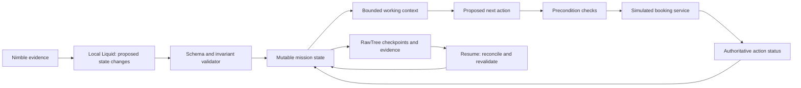

# DEAD RECKONING — recommended hackathon project
Research decision · 25 September 2026 · Proposal only; no implementation or benchmark results

## Decision

Build **DEAD RECKONING**, an agent that resumes a trip-planning mission after a crash, checks which actions actually happened, revalidates what changed, and finishes a valid itinerary—or stops with a precise unresolved constraint.

**Pitch:** “The agent went offline. The world kept changing. Watch it recover without losing its commitments.”

Use exactly **Tinybird/RawTree, Nimble and Liquid AI** as the three sponsor integrations. Frame the product as a continuity layer for long-running agents, demonstrated through a compact travel mission. Travel supplies understandable stakes; the underlying state contract also applies to operations and coding workflows.

Fable generated six first-round ideas, then three revised concepts after a critique grounded in current research. Both actual CLI calls resolved to **claude-fable-5-1**. Fable withdrew its first UNLEARN choice and selected Dead Reckoning. The research review agrees on the stronger live demonstration, while retaining UNLEARN as the lower-risk coding alternative. Actual outputs and corrections: [Fable record](fable-ideation-refresh.md).

## The story

Plan a three-day island trip with four linked steps: ferry, campsite, permit and gear pickup. Preserve the user's dates, party size, accessibility needs and budget. These are explicit constraints, not facts to summarize away.

The agent reserves a ferry in a **local simulated booking service**. The booking exists, but the agent dies before recording success. While it is offline, apply a labeled campsite-closure test event and advance the simulation clock. Restart the agent.

It must discover that the ferry reservation already exists, avoid creating another, check which sources and constraints still apply, and repair only the affected portion of the itinerary. If no valid trip remains, it should return a justified blocked state rather than invent success.

No real bookings, payments, cancellations or emails are required. The action service, receipts, costs and time jumps are explicitly simulated. Real web evidence and injected test events are displayed separately.

## Why this addresses the brief

| Hackathon requirement | Concrete behavior |
| --- | --- |
| Explicit mutable state | Current facts, commitments, constraints and plan statuses are typed records. |
| Agent edits its working context | Liquid proposes KEEP, RETIRE, CONFLICT and RECALL decisions; validated changes determine what reaches the next prompt. |
| Preserve what matters | User constraints, pending obligations, acknowledged outcomes and action identifiers survive context eviction and restart. |
| Discard what no longer matters | Raw pages, superseded guidance and transient tool output leave active context. Unpromoted transient data can expire under a declared retention policy. |
| Long-running reliability | Changes, delayed obligations, compaction and a real worker interruption are exercised in one mission. |

A replay of simulated days is not proof of actual multi-day uptime. State this in the demo.

## Three sponsors with meaningful roles

| Sponsor | Role in the actual runtime | Visible proof |
| --- | --- | --- |
| **Nimble** | Fetch official timetables, park rules and alerts; return cited evidence for the small set of facts needing revalidation. | A fact card shows source URL, retrieval time, relevant source date and excerpt. Live versus cached fetches are labeled. |
| **Liquid AI** | A small local LFM proposes structured claim updates, applicability changes, context eviction and the next action from a bounded set. Code validates the proposal. | On-device curator activity and a visible working-state delta, with measured latency. |
| **Tinybird / RawTree** | Persist evidence versions, complete checkpoints, intents and observed action results; serve recall and recovery queries; record measurements. | Restart loads an acknowledged checkpoint and reconstructs the state shown on screen. |

These vendors are implementation choices for necessary architectural roles, not scientifically irreplaceable components.

Verified primary docs: [Nimble trust](https://docs.nimbleway.com/nimble-sdk/web-search-agents/trust), [Nimble effort/latency](https://docs.nimbleway.com/nimble-sdk/web-search-agents/efforts), [Liquid local inference](https://docs.liquid.ai/deployment/on-device/llama-cpp), [Liquid structured output](https://docs.liquid.ai/deployment/on-device/llama-cpp/structured-output), [RawTree ingest](https://rawtree.com/docs/guides/ingest-data), [RawTree query](https://rawtree.com/docs/guides/query-data).

Keep all three integrations in the MVP. If free-form planning is unreliable, narrow the action vocabulary and scenario; do not silently replace Liquid with a wholly deterministic implementation and still claim three-sponsor usage.

## Architecture and the important crash boundary

Use a single-writer runner, a local durable state/outbox, and complete versioned checkpoints in RawTree. RawTree's examined query interface is read-only SQL; model updates through append-only events or new snapshots and a current-state projection. Do not assume multi-row transactions or compare-and-swap.

**Correct execution protocol:**

1. Persist an **intent** and stable action/idempotency key.
2. Send the action to the simulated service.
3. The service commits the result in its own authoritative store.
4. Record the returned **result receipt** in agent state and RawTree.
5. If interrupted between steps 3 and 4, query the service by action key on resume. Do not infer failure from a missing agent receipt.

The service provides idempotency for the demo. The agent reconciles it. An agent log by itself cannot guarantee exactly-once remote effects. If a real provider cannot report an uncertain outcome, the correct state can be “unknown; needs resolution.”

A stored booking is not the same as a currently useful booking. Keep its receipt while marking its role in the new plan invalid. If cancellation is supported, issue a separately tracked compensating action; otherwise surface the remaining commitment explicitly.

A compact schema:
- **Constraint:** identity, scope, value, user/source authority, version.
- **Fact:** key, scope, value, source reference, observed time, source-stated effective dates when known, freshness policy, status.
- **Commitment:** action key, resource/date/party, intent/pending/confirmed/cancelled/unknown, result reference.
- **Receipt:** service result ID, action key, outcome, timestamp, compensation reference if any.
- **Plan step:** dependencies, required facts, commitment reference, status.
- **Checkpoint:** complete schema version, input cursor, state version, pending action keys, evidence references.

Use the whole source bundle only during extraction. Subsequent model calls receive constraints, unresolved commitments, the affected plan fragment and a bounded evidence excerpt. Recall cold evidence by ID when necessary.

## Retention and forgetting

| Data | Policy |
| --- | --- |
| User constraints and unresolved commitments | Preserve while the mission is active; never remove through summarization. |
| Applicable facts | Keep compact records; update or flag conflicts when scope or evidence changes. |
| Superseded facts and cancelled actions | Remove from active context; retain relevant lineage and receipts for audit/recovery. |
| Raw pages | Offload by source/hash; keep necessary cited evidence under a declared retention policy. |
| Unpromoted search noise and transient scratch output | Discard after the step or a short TTL; no promise of future recall. |

A freshness deadline is a policy decision unless the source supplies one. A high Nimble evidence grade is not proof of truth or freshness. Validate entity, time and scope, and preserve ambiguity rather than automatically selecting the newest or highest-graded claim.

Cold storage and active context have different budgets. This design bounds the prompt; it does not imply unlimited free storage.

## Ninety-second demonstration

1. **0–15s:** Show the mission map and user constraints. A ferry reservation appears as a receipt in the simulated service.
2. **15–30s:** Kill the worker after that service commit but before the agent saves the result. Show the process is actually stopped.
3. **30–40s:** Apply **TEST EVENT: campsite closed** and a clearly labeled simulated clock jump.
4. **40–60s:** Restart from RawTree. The agent checks the outstanding action key and recovers the existing reservation. It marks volatile facts for revalidation.
5. **60–80s:** Nimble evidence plus the explicit test event produce a Liquid state proposal. The old campsite leaves working context; affected steps are repaired; unchanged commitments remain visible.
6. **80–90s:** An independent validator reports a valid itinerary or a precise block. Show actual duplicate effects, stale-precondition actions, input tokens and recovery time.

Use a map/route, a receipt strip and a small working-context tray. The key visual is a route changing while a receipt survives. Avoid making a generic metrics dashboard the main product.

For dependable timing, capture real Nimble source bundles early and offer a labeled replay. A fixture closure must never be presented as a real park closure discovered on the live web.

## Evaluation: separate memory benefit from workflow plumbing

Use three fixed scenarios: unchanged world, changed ferry time, and campsite closure. Keep the model, tools, source bundle, budget, start state and fault schedule equal.

The main comparator should be a **durable summary/checkpoint agent with the same idempotent action service and receipt access**. This tests whether explicit applicability, revalidation and context management improve continuation. Do not compare only against an agent deliberately denied every recovery primitive.

A plan-only naive resume can be a clearly labeled illustrative second comparison. It does not establish superiority over modern workflow engines.

Measure:
- Final constraint-valid itinerary or correct blocked result.
- Actions attempted with stale or unsatisfied preconditions.
- Duplicate action attempts and actual duplicate service effects separately.
- Unaffected commitments retained correctly.
- Actual context size per step and total model input, including curation and recall.
- Recovery wall time and repeated tool work.
- Pending obligations lost during compaction.

Report ties and failures. No pass rates, dollar savings or latency numbers exist yet. If useful, run an eviction-only ablation to separate smaller prompts from better state correctness.

Deterministic checks should include: every action has an intent; repeated keys resolve consistently; unknown outcomes are reconciled or blocked; required facts meet the current scope/freshness policy; incompatible active commitments are not silently hidden; a terminal success meets every mission constraint.

## Novelty and prior art

Do not pitch this as inventing persistent state, idempotency, time travel, forgetting, or dependency graphs:

- [Letta](https://docs.letta.com/configuration/memory) already provides self-edited memory, MemFS and consolidation.
- [Mem0 Dream](https://mem0.ai/blog/dream-background-memory-consolidation-for-ai-agents) covers merging and supersession.
- [Zep](https://help.getzep.com/facts) models temporal facts and invalidation.
- [Dependency-guided rollback research](https://arxiv.org/html/2608.10502v1) already covers causal invalidation and selective replay, under explicit assumptions about faults and effects.
- [Safe to Resume?](https://arxiv.org/html/2608.29381v1) examines checkpoint/external-state mismatches.
- [Temporal's official documentation](https://docs.temporal.io/activity-definition) explicitly discusses successful effects occurring before the worker reports completion and the need for service-enforced idempotency.

Our proposed product contribution is an accessible demonstration and reusable state contract combining **semantic forgetting, external-fact revalidation, action reconciliation and bounded context**. This is an engineering/product integration claim, not a world-first research claim.

Past organizers explicitly rewarded visible memory behavior and reproducible restart behavior at [Memories That Last](https://memories-that-last-hackathon.devpost.com/). [AI Tinkerers winners](https://aitinkerers.org/hackathons/h_XtF20GeHnS4/showcase) provide examples of concrete operational workflows. These are precedents, not evidence of this event's judging formula.

## Build scope

The organizer's [event page](https://tokensand.com/horizonagentshack) gives 11:00 AM kickoff and 4:30 PM submission Pacific, up to four people, and requires the project to be built during the event.

Assuming 2–4 builders:
- **First 30 minutes:** smoke-test all three integrations and save real response shapes.
- **Next 90 minutes:** typed state, deterministic booking service, authoritative receipts, action reconciliation and checkpoint restore.
- **Next 60 minutes:** Nimble evidence + Liquid validated changes + explicit context eviction.
- **Next 60 minutes:** mission map, receipt strip, real kill/restart interaction.
- **Final 90 minutes:** fixed-scenario comparison, repairs, video and submission.

Build one route, two campsites, a few sailing options and three fault fixtures. No payment system, broad travel search, multi-agent swarm, live vendor booking, voice assistant, or general-purpose workflow framework.

The hardest risk is that it looks like a scripted toy. Address it with a real local model choosing among validated actions, sponsor calls with inspectable provenance, actual worker termination, service-state reconciliation and a validator independent of the agent.

## Ranked alternatives

| Rank | Idea | Best reason to choose it | Main weakness |
| --- | --- | --- | --- |
| 1 | **Dead Reckoning** | Clearest causal story: changed world, lasting action, bounded memory, actual recovery. | Requires transparent separation of simulation and live evidence. |
| 2 | **UNLEARN** | Real code artifacts and strong test oracles; easier for a developer-heavy team. | Migration/codemod and version filtering are established; tiny workload may not show context benefit. |
| 3 | **Event Desk** | Meetup agent preserves confirmations while replacing cancelled speakers and rechecking venue constraints. | Mail/venue sandbox adds setup and can become ordinary task automation. |
| 4 | **Receipt Check** | Release agent reconciles tags/publishes after a crash, then blocks on changed dependencies. | Good engineering but a less immediately legible demonstration. |

UNLEARN details are retained in [the alternative build plan](UNLEARN_ALTERNATIVE_2026-09-25.md). Quarantine and a standalone memory dashboard are weaker standalone entries; keep their useful mechanisms inside a complete mission.

## Evidence files

- [Actual Fable ideation, critique and reviewer corrections](fable-ideation-refresh.md)
- [Competitive research: six searches, eight primary pages](competition-refresh.md)
- [Six official sponsor pages verified](sponsor-feasibility-refresh.md)
- [Event requirements and past-event evidence](event-and-demo-evidence-refresh.md)

Fresh source captures are stored under `.firecrawl/`. Scope: selected primary papers, official product docs and organizer records, building on prior workspace research. This is not a search of every website or a guarantee of competitive novelty. No application has been built, run or benchmarked by this research task.

