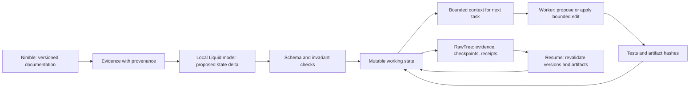

# Alternative project: UNLEARN
Research and proposal · 25 September 2026 · Not yet implemented or benchmarked

**Decision update:** After Fable's second critique, DEAD RECKONING is the lead recommendation. This remains the lower-risk coding-focused alternative. See [the final recommendation](RECOMMENDED_PROJECT_2026-09-25.md).

## Recommendation

**Build UNLEARN: a coding agent that retires obsolete assumptions, repairs the affected work, and survives an interrupted migration.**

The audience sees a real repository changing and real tests passing. Its working memory remains bounded. Its durable state distinguishes what was requested, what is currently applicable, what was actually changed, and what still needs verification.

This recommendation combines Fable's two strongest first-round ideas, **Unlearn** and **Pull the Plug**, with a stricter recovery protocol from the research review. It replaces the earlier ASOF dashboard as this research pass's preferred direction. The prior proposal remains in place for reference.

This is a best-bet product judgment, not a claim that it will win or that its underlying memory techniques are new.

## The human problem and pitch

A developer starts a library migration. The agent reads old and new documentation, makes progress, accumulates tool output, and gets interrupted. On resumption, it can reuse an obsolete assumption, trust a stale completion marker, or redo an edit that already landed.

**Pitch:** “When the facts change, UNLEARN repairs its work. When the process dies, it checks the work and carries on.”

An ordinary migration tool addresses known transformations. This project's subject is the long-running agent around those transformations: what enters its working context, when evidence stops applying, whether completed work remains valid, and how it continues after a crash.

## Exactly three sponsor integrations

| Sponsor | Concrete runtime role | What judges can inspect |
| --- | --- | --- |
| **Nimble** | Retrieve version-specific official migration documentation and source excerpts. A fact retains the URL, source version, retrieval time and evidence span. | The source behind a retired assumption and its replacement. |
| **Liquid AI** | A local LFM proposes typed keep, retire, conflict and recall decisions from small evidence bundles. Its patch proposals pass application validation before changing state. For an exactly-three-sponsor MVP, use one local LFM for bounded patch selection as well; do not make success depend on an untested general coding agent. | Local model activity, validated state deltas, measured curator latency, and the shrinking active context. |
| **Tinybird / RawTree** | Store versioned evidence, checkpoints, artifact/test receipts, and run measurements. The runner recalls evidence and loads acknowledged checkpoints through SQL. | Recovery from a stored checkpoint, the provenance behind a change, and actual per-step context/token measurements. |

These are essential roles in this implementation; other vendors or deterministic code could replace parts of the design. Vendor exclusivity is not the argument.

Verified documentation: [Nimble trust reports](https://docs.nimbleway.com/nimble-sdk/web-search-agents/trust), [Liquid structured output](https://docs.liquid.ai/deployment/on-device/llama-cpp/structured-output), [RawTree ingest](https://rawtree.com/docs/guides/ingest-data), [RawTree queries](https://rawtree.com/docs/guides/query-data). The [organizer lists all three sponsors](https://tokensand.com/horizonagentshack).

## A deliberately small, credible first workload

Use a repository with **8–12 Python files**, two independent groups, and one shared Pydantic model. Pin the source and target package versions. Start with two real behavioral changes:

- In Pydantic V2, an `Optional[T]` annotation without a default does not itself make the field optional to provide. Preserve the application's intended missing-value behavior with a tested migration.
- A validator's `TypeError` is no longer automatically converted into a `ValidationError`. Preserve the intended error contract where the application depends on it.

The official guide also documents a codemod, `bump-pydantic`. Treat that as a reference/helper available equally to comparison arms, not a nonexistent competitor. Old names such as `.dict()` and `@validator` can still exist as deprecated compatibility paths; do not claim they always fail. [Official migration guide](https://docs.pydantic.dev/latest/migration/)

Before coding, define observable application contracts and a fixed test suite. Do not pick tasks because a baseline happens to fail them.

## State architecture

Maintain four distinct categories:

| Category | Policy |
| --- | --- |
| Goal and application contracts | Persist explicitly; only an authorized requirement change can replace them. |
| Version-scoped API facts and task dependencies | Update applicability; retain provenance; unresolved conflicts remain explicit. |
| Completed-work receipts | Persist artifact hash, specification/dependency hashes, environment version and test outcome. Reuse only after checks still match. |
| Raw docs, old logs, superseded guidance and scratch output | Evict from active context. Keep relevant cold evidence or pointers under a defined retention policy. |

A fact can be historically correct but irrelevant to the selected target. “Unlearn” means removing its authority over the next action, not erasing audit history or pretending old documentation was false.

Use a **single writer** and a small local SQLite or atomically replaced JSON checkpoint. RawTree is an append/read-only-SQL system in the examined interface: write complete versions or events and derive the current projection. Do not design around unsupported SQL UPDATE, distributed transactions, or universal exactly-once guarantees.

On resume:
1. Load an acknowledged checkpoint and pending-operation cursor.
2. Check the dependency lockfile/environment version and affected artifact hashes.
3. Reconcile any write that landed before its completion receipt.
4. Invalidate only work whose dependencies no longer hold.
5. Rebuild the bounded working context and continue.

A missing receipt is an **unknown outcome**, not proof that an edit never occurred. This is the interesting crash boundary.

The context assembler uses a measured cap, for example 4K or 8K tokens selected after the first smoke test. That cap is a design target, not a current performance result.

## The 90-second demo

- **0–15 seconds:** Show the repository, target version, two application contracts and a file dependency map. Name the task in ordinary language.
- **15–35 seconds:** Present versioned source evidence. The local curator retires an old assumption from active context. Only dependent files reopen; an unrelated tested group stays complete. Show an actual test outcome.
- **35–50 seconds:** Click “Kill worker” after an edit lands but before its receipt is committed. The worker process really exits.
- **50–70 seconds:** Restart. UNLEARN queries its checkpoint, checks file hashes, reconciles the pending write, and resumes the remaining work.
- **70–90 seconds:** Show the actual final test results, context usage, repeated edits, recovery time, and preserved valid work. Open one retired assumption to show its source is still recoverable.

Use one screen with three coordinated regions: file graph, live application/test result, and a narrow state-change stream. A red retired assumption should visibly stop influencing future code. Keep charts secondary to that causal story.

Recorded Nimble results and accelerated steps must be labeled. This demonstrates continuity across many operations and a real interruption, not days of continuous deployment. Do not pre-animate a success path while presenting it as a live model run.

## Evaluation that a judge can trust

Compare UNLEARN against a sensible summary/checkpoint agent, with the same model, tools, source material, starting repository, task order, budget, and kill point. Give both arms the original constraints and access to the same helper tools. Do not intentionally hide requirements from the baseline.

| Metric | How to measure |
| --- | --- |
| Correctness | Independent fixed application tests; report actual passes and failures. |
| Preservation of valid work | Hashes and unchanged test results for unaffected files. |
| Recovery | Wall time and model/tool calls from process restart to the first correct next action. |
| Duplicate work | Repeated committed edits, redundant reads and re-executed operations. |
| Context/cost | Actual token counts for all model calls, including curation and recall; distinguish local compute from hosted cost. |
| State safety | No dangling evidence/dependency references; open obligations survive compaction. |

If time permits, run three seeds and an eviction-only ablation. Report ties. A useful outcome can be equal correctness with less repeated work and bounded context; do not require an invented baseline disaster.

No “1/5 versus 5/5,” “zero lost work,” “12 ms,” or percentage savings belongs in the pitch until measured.

## Why this is a stronger bet

- The event explicitly calls for mutable state, self-managed working context and persistence/discard separation. This project makes all three visible.
- A repository and test suite provide a stronger correctness oracle than an agent grading its own research report.
- The three sponsors participate in the runtime rather than only the presentation.
- A visible kill-and-recover moment is memorable, but the technical substance is revalidation: a checkpoint alone is insufficient.
- The five-hour scope has an honest endpoint: one migration, one state contract, one real crash, one measured result.

Existing products already do much of the underlying memory work: [Letta memory](https://docs.letta.com/configuration/memory), [Mem0 Dream](https://mem0.ai/blog/dream-background-memory-consolidation-for-ai-agents), and [Zep temporal facts](https://help.getzep.com/facts). Research already describes [dependency-guided repair](https://arxiv.org/html/2608.10502v1) and [the gap between checkpoint state and external effects](https://arxiv.org/html/2608.29381v1). The proposed contribution is an understandable, tested integration for a real workflow, not a world-first memory primitive.

Earlier hackathon evidence supports concrete applications and visible memory behavior: [AI Tinkerers official winners](https://aitinkerers.org/hackathons/h_XtF20GeHnS4/showcase) and [Memories That Last judging criteria](https://memories-that-last-hackathon.devpost.com/). Those are useful precedents, not this event's official judging rubric.

## Build allocation for the 5.5-hour window

Assume 2–4 builders; a solo version must cut the comparison harness and visual graph first, retaining the core test/recovery path.

| Time from kickoff | Deliverable |
| --- | --- |
| 0:00–0:30 | RawTree insert/query, one local Liquid constrained response, Nimble source bundle; verify the actual laptop can handle the chosen small model. |
| 0:30–1:30 | Fixture repository + independent tests; typed state, dependencies, context assembly and validated curator deltas. |
| 1:30–2:30 | Bounded patch application; artifact receipts; acknowledged checkpoint and restart reconciliation. |
| 2:30–3:30 | Working vertical demo and file graph; complete source-to-memory-to-test path. |
| 3:30–4:30 | Fixed comparative runs, failure corrections, real process interruption. |
| 4:30–5:30 | Freeze scope, record video, write README and submit before 4:30 PM Pacific. |

Avoid a generic agent framework, multi-agent swarms, extra models, fine-tuning, arbitrary library support, distributed writers, cloud deployment machinery and a fourth sponsor integration. If local general code generation is unreliable, narrow edits to explicitly supported transformations and disclose that boundary.

## Remaining uncertainties

- An 8–12-file demo cannot establish broad multi-day reliability.
- A modern baseline may also succeed; performance improvement must be measured.
- Dependency completeness and receipt validation are where subtle errors can hide.
- Sponsor account/API access and local model latency still need event-time smoke tests.
- There is no verified event rule here promising multiple sponsor prizes to one entry.

## Research trail

- [Actual Fable ideation and critique](fable-ideation-refresh.md)
- [Competitive research](competition-refresh.md)
- [Sponsor capability verification](sponsor-feasibility-refresh.md)
- [Event and demo evidence](event-and-demo-evidence-refresh.md)

Fresh Firecrawl captures are retained under `.firecrawl/`. The old ASOF proposal and broad research notes were leads, not treated as ground truth. No application code, benchmark, or deploy was produced by this research task.
